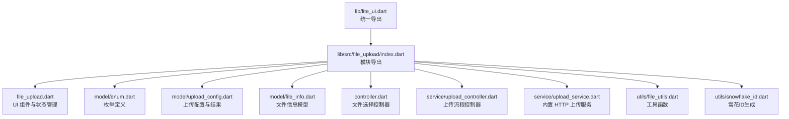
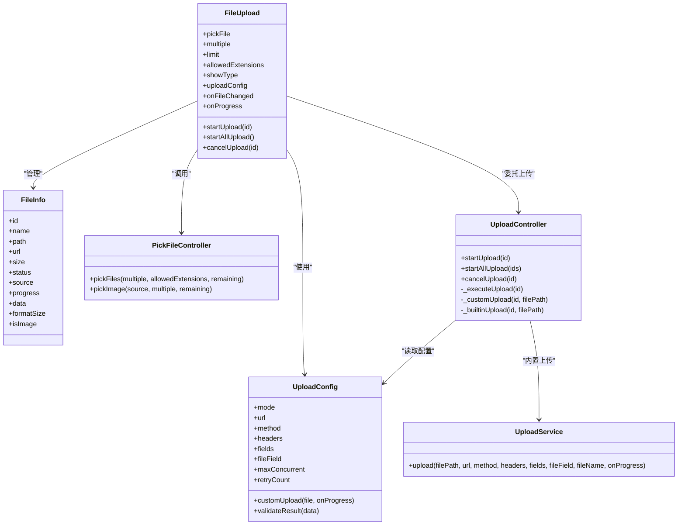
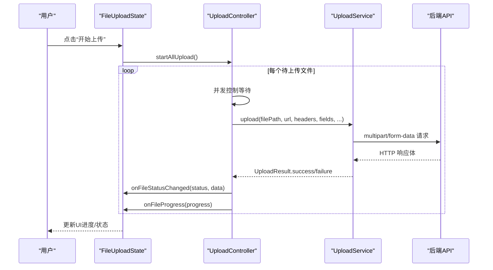
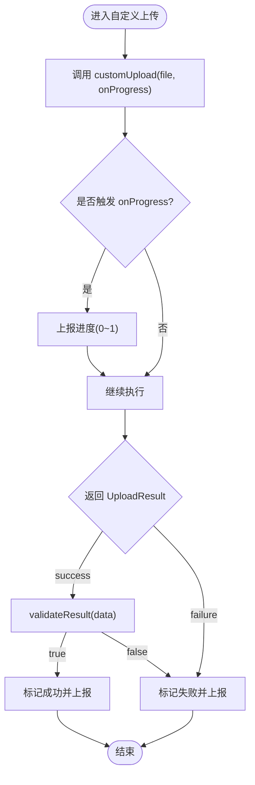
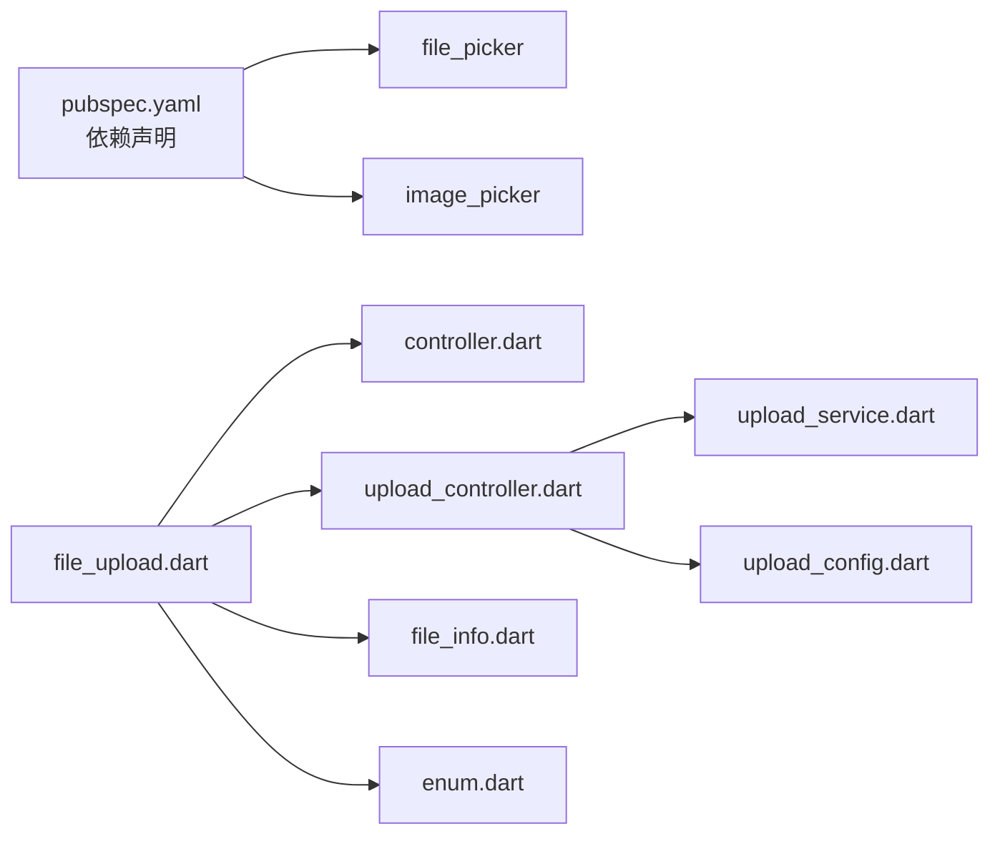

# 高级功能和自定义扩展

<cite>
**本文引用的文件**   
- [lite_ui.dart](file://lib/lite_ui.dart)
- [pubspec.yaml](file://pubspec.yaml)
- [README.md](file://README.md)
- [index.dart（file_upload）](file://lib/src/file_upload/index.dart)
- [enum.dart（file_upload）](file://lib/src/file_upload/model/enum.dart)
- [upload_config.dart](file://lib/src/file_upload/model/upload_config.dart)
- [controller.dart（file_upload）](file://lib/src/file_upload/controller.dart)
- [file_upload.dart](file://lib/src/file_upload/file_upload.dart)
- [file_info.dart](file://lib/src/file_upload/model/file_info.dart)
- [upload_controller.dart](file://lib/src/file_upload/service/upload_controller.dart)
- [upload_service.dart](file://lib/src/file_upload/service/upload_service.dart)
- [file_utils.dart](file://lib/src/file_upload/utils/file_utils.dart)
- [snowflake_id.dart](file://lib/src/file_upload/utils/snowflake_id.dart)
- [readme.md（file_upload）](file://lib/src/file_upload/readme.md)
</cite>

## 目录
1. [简介](#简介)
2. [项目结构](#项目结构)
3. [核心组件](#核心组件)
4. [架构总览](#架构总览)
5. [详细组件分析](#详细组件分析)
6. [依赖关系分析](#依赖关系分析)
7. [性能与并发控制](#性能与并发控制)
8. [错误处理与日志记录](#错误处理与日志记录)
9. [企业级实践与示例](#企业级实践与示例)
10. [故障排查指南](#故障排查指南)
11. [结论](#结论)

## 简介
本文件面向 Lite UI 的文件上传组件，聚焦“高级功能与自定义扩展”。内容涵盖：
- 自定义上传函数的实现方法（HTTP 客户端集成、进度回调、结果校验）
- 文件分片上传的扩展思路与最佳实践
- 枚举类型的定义与应用（UploadMode、FileType、UploadStatus 等）
- 组件可定制性（样式覆盖、布局调整、交互行为修改）
- 插件化架构设计（第三方库集成、自定义组件开发）
- 性能调优、错误处理、日志记录等企业级应用要点

## 项目结构
Lite UI 通过统一入口导出各模块，其中文件上传相关能力集中在 lib/src/file_upload 下，包含模型、控制器、服务、工具与 UI 组件。

图表来源
- [lite_ui.dart:1-19](file://lib/lite_ui.dart#L1-L19)
- [index.dart（file_upload）:1-6](file://lib/src/file_upload/index.dart#L1-L6)

章节来源
- [lite_ui.dart:1-19](file://lib/lite_ui.dart#L1-L19)
- [pubspec.yaml:1-21](file://pubspec.yaml#L1-L21)
- [README.md:1-126](file://README.md#L1-L126)

## 核心组件
- FileUpload：提供文件选择、展示（卡片/列表/自定义）、上传模式（自动/手动/自定义）、进度回调、头像模式等。
- UploadConfig：定义上传模式、URL、请求头、表单字段、并发与重试、自定义上传函数与结果校验。
- FileInfo：统一文件生命周期数据（id、name、path、url、size、status、source、progress、data）。
- PickFileController：封装 file_picker 与 image_picker，返回统一的 FileInfo 列表。
- UploadController：负责上传生命周期（并发控制、重试、取消、进度追踪、分发到内置或自定义上传）。
- UploadService：基于 dart:io 的 multipart/form-data 上传服务（Web 平台不可用，需走 custom 模式）。

章节来源
- [file_upload.dart:15-165](file://lib/src/file_upload/file_upload.dart#L15-L165)
- [upload_config.dart:31-99](file://lib/src/file_upload/model/upload_config.dart#L31-L99)
- [file_info.dart:10-74](file://lib/src/file_upload/model/file_info.dart#L10-L74)
- [controller.dart（file_upload）:11-67](file://lib/src/file_upload/controller.dart#L11-L67)
- [upload_controller.dart:22-34](file://lib/src/file_upload/service/upload_controller.dart#L22-L34)
- [upload_service.dart:12-32](file://lib/src/file_upload/service/upload_service.dart#L12-L32)

## 架构总览
文件上传组件采用分层解耦设计：
- UI 层：FileUpload 负责用户交互与展示
- 控制层：PickFileController 与 UploadController 分别负责文件选择与上传流程
- 服务层：UploadService 提供内置 HTTP 上传能力
- 模型与枚举：FileInfo、UploadConfig、各类枚举贯穿全链路

图表来源
- [file_upload.dart:15-165](file://lib/src/file_upload/file_upload.dart#L15-L165)
- [upload_config.dart:31-99](file://lib/src/file_upload/model/upload_config.dart#L31-L99)
- [file_info.dart:10-74](file://lib/src/file_upload/model/file_info.dart#L10-L74)
- [controller.dart（file_upload）:11-67](file://lib/src/file_upload/controller.dart#L11-L67)
- [upload_controller.dart:22-34](file://lib/src/file_upload/service/upload_controller.dart#L22-L34)
- [upload_service.dart:12-32](file://lib/src/file_upload/service/upload_service.dart#L12-L32)

## 详细组件分析

### 枚举类型详解与应用场景
- UploadStatus：待上传、上传中、成功、失败。用于驱动 UI 状态与操作按钮显示。
- ShowType：卡片、文本列表、自定义。决定文件列表渲染方式。
- FileSource：文件、图片、拍照、图片或拍照、全部、网络地址。标识文件来源。
- FileAction：默认加载、添加、移除、上传中、进度、成功、失败。用于 onFileChanged 回调动作。
- PickFile：文件、相册、拍照、全部、图片或拍照。控制选择器入口。
- ActionFileSheet：预览、重试、替换、删除。卡片点击后的操作菜单。
- UseType：普通模式、头像模式。头像模式强制单图、限制选择方式为图片/相机。
- UploadMode：自动、手动、自定义。控制上传触发策略。

章节来源
- [enum.dart（file_upload）:1-105](file://lib/src/file_upload/model/enum.dart#L1-L105)
- [upload_config.dart:6-29](file://lib/src/file_upload/model/upload_config.dart#L6-L29)

### 文件信息模型 FileInfo
- id：雪花算法生成的唯一标识，用于前端操作匹配。
- path：本地路径（可为空，编辑模式下后端已有文件时无需本地路径）。
- url：网络访问地址（http 开头自动识别为 success 状态）。
- size：字节大小；formatSize 提供格式化输出。
- status/source/progress/data：上传状态、来源、进度、扩展数据（服务端响应）。
- isImage：根据扩展名判断是否为图片。

章节来源
- [file_info.dart:10-74](file://lib/src/file_upload/model/file_info.dart#L10-L74)
- [file_info.dart:112-125](file://lib/src/file_upload/model/file_info.dart#L112-L125)
- [snowflake_id.dart:19-38](file://lib/src/file_upload/utils/snowflake_id.dart#L19-L38)

### 上传配置 UploadConfig
- mode：auto/manual/custom。
- url/method/headers/fields/fileField：HTTP 参数与表单字段。
- maxConcurrent/retryCount：并发与重试策略。
- customUpload：完全自定义上传逻辑，接收 FileInfo 与 onProgress 回调。
- validateResult：业务成功校验，默认仅校验 HTTP 2xx。

章节来源
- [upload_config.dart:31-99](file://lib/src/file_upload/model/upload_config.dart#L31-L99)
- [upload_config.dart:101-139](file://lib/src/file_upload/model/upload_config.dart#L101-L139)

### 文件选择控制器 PickFileController
- pickFiles：支持多选/单选、扩展名过滤、剩余数量限制。
- pickImage：支持相册多选、相册单选、拍照（单选），返回统一 FileInfo 列表。

章节来源
- [controller.dart（file_upload）:11-67](file://lib/src/file_upload/controller.dart#L11-L67)

### 上传流程控制器 UploadController
- startUpload/startAllUpload：按并发上限调度上传任务。
- cancelUpload：将状态恢复为 pending，支持中断。
- _executeUpload：重试逻辑、取消检查、分发到内置或自定义上传。
- 进度上报：通过 onProgress 回调实时反馈。

章节来源
- [upload_controller.dart:22-34](file://lib/src/file_upload/service/upload_controller.dart#L22-L34)
- [upload_controller.dart:36-65](file://lib/src/file_upload/service/upload_controller.dart#L36-L65)
- [upload_controller.dart:67-122](file://lib/src/file_upload/service/upload_controller.dart#L67-L122)

### 内置 HTTP 上传服务 UploadService
- 使用 dart:io HttpClient 以 multipart/form-data 上传。
- 支持自定义请求头、额外表单字段、文件字段名。
- 分块发送与节流进度回调，避免过度刷新 UI。
- Web 平台不可用，需改用 custom 模式。

章节来源
- [upload_service.dart:12-32](file://lib/src/file_upload/service/upload_service.dart#L12-L32)
- [upload_service.dart:82-104](file://lib/src/file_upload/service/upload_service.dart#L82-L104)
- [upload_service.dart:137-181](file://lib/src/file_upload/service/upload_service.dart#L137-L181)

### UI 组件 FileUpload
- 支持三种展示模式：card/textInfo/custom。
- 头像模式自动覆盖 limit=1、multiple=false、pickFile=imageOrCamera。
- 提供 onFileChanged/onProgress 回调，便于外部同步状态。
- 支持自定义上传按钮构建器与装饰样式。

章节来源
- [file_upload.dart:15-165](file://lib/src/file_upload/file_upload.dart#L15-L165)
- [file_upload.dart:452-592](file://lib/src/file_upload/file_upload.dart#L452-L592)

#### 序列图：手动上传流程

图表来源
- [file_upload.dart:313-326](file://lib/src/file_upload/file_upload.dart#L313-L326)
- [upload_controller.dart:51-57](file://lib/src/file_upload/service/upload_controller.dart#L51-L57)
- [upload_service.dart:23-32](file://lib/src/file_upload/service/upload_service.dart#L23-L32)

#### 流程图：自定义上传函数执行

图表来源
- [upload_controller.dart:124-135](file://lib/src/file_upload/service/upload_controller.dart#L124-L135)
- [upload_config.dart:63-85](file://lib/src/file_upload/model/upload_config.dart#L63-L85)

## 依赖关系分析
- 包依赖：file_picker、image_picker 提供系统级文件与图片选择能力。
- 内部依赖：FileUpload 依赖控制器与服务；UploadController 依赖 UploadService；工具类提供辅助能力。

图表来源
- [pubspec.yaml:10-15](file://pubspec.yaml#L10-L15)
- [file_upload.dart:1-14](file://lib/src/file_upload/file_upload.dart#L1-L14)
- [controller.dart（file_upload）:1-6](file://lib/src/file_upload/controller.dart#L1-L6)
- [upload_controller.dart:1-8](file://lib/src/file_upload/service/upload_controller.dart#L1-L8)
- [upload_service.dart:1-6](file://lib/src/file_upload/service/upload_service.dart#L1-L6)

章节来源
- [pubspec.yaml:10-15](file://pubspec.yaml#L10-L15)

## 性能与并发控制
- 并发控制：UploadController 通过 maxConcurrent 限制同时进行的上传任务数，超出时排队等待。
- 进度节流：UploadService 在分块发送时按百分比节流上报，避免频繁 UI 重建。
- 事件循环让出：每若干块发送后让出事件循环，保证 UI 及时刷新。
- 文件大小获取：file_utils 提供 HEAD/GET 回退策略获取远程文件大小，减少不必要的数据传输。

优化建议
- 合理设置 maxConcurrent（如 3~5），避免过多并发导致内存与带宽压力。
- 大文件上传建议使用分片上传（见下一节扩展方案）。
- 使用 validateResult 快速判定业务成功，减少无效重试。

章节来源
- [upload_controller.dart:36-49](file://lib/src/file_upload/service/upload_controller.dart#L36-L49)
- [upload_service.dart:82-104](file://lib/src/file_upload/service/upload_service.dart#L82-L104)
- [file_utils.dart:25-50](file://lib/src/file_upload/utils/file_utils.dart#L25-L50)

## 错误处理与日志记录
- 异常捕获：UploadService 对 SocketException、HttpException 与未知异常进行捕获并返回失败结果。
- 调试日志：关键步骤打印 URI、MIME、body 长度、响应码与响应体片段，便于定位问题。
- 业务校验：validateResult 失败时标记 failed，避免误判成功。
- 取消机制：UploadController 维护取消标志，确保中断后不再继续上传。

章节来源
- [upload_service.dart:122-134](file://lib/src/file_upload/service/upload_service.dart#L122-L134)
- [upload_controller.dart:67-122](file://lib/src/file_upload/service/upload_controller.dart#L67-L122)

## 企业级实践与示例

### 与后端 API 集成（内置上传）
- 配置 UploadConfig.mode=auto/manual，提供 url、headers、fields、fileField。
- 通过 onFileChanged 与 onProgress 同步状态与进度。
- 使用 validateResult 校验业务成功（例如 data.code==200）。

章节来源
- [upload_config.dart:31-99](file://lib/src/file_upload/model/upload_config.dart#L31-L99)
- [file_upload.dart:313-326](file://lib/src/file_upload/file_upload.dart#L313-L326)

### 自定义上传函数（HTTP 客户端集成）
- 设置 UploadConfig.mode=custom，传入 customUpload。
- 在 customUpload 中调用自有网络库，按进度调用 onProgress。
- 返回 UploadResult.success(data) 或 failure(error)。

章节来源
- [upload_config.dart:63-85](file://lib/src/file_upload/model/upload_config.dart#L63-L85)
- [upload_controller.dart:124-135](file://lib/src/file_upload/service/upload_controller.dart#L124-L135)

### 文件分片上传（扩展实现思路）
- 在 customUpload 中将文件按固定大小切分为多个分片。
- 逐个上传分片，每次调用 onProgress 累计已上传比例。
- 所有分片完成后，通知后端合并，返回最终 URL 与元数据。
- 失败分片支持重试与断点续传（结合服务端接口）。

说明：该方案为扩展思路，需在 customUpload 中自行实现分片与合并逻辑。

### 文件加密上传（扩展实现思路）
- 在 customUpload 中对文件流进行加密（如 AES/GCM），再上传密文。
- 将密钥或 IV 通过 headers/fields 安全传递（建议使用服务端协商）。
- 上传成功后，将解密所需信息与文件 URL 一并保存至 data。

说明：该方案为扩展思路，需在 customUpload 中实现加解密与协议适配。

### 水印添加（扩展实现思路）
- 在 customUpload 前对图片进行压缩与水印合成（可使用 image 库）。
- 将处理后文件写入临时路径，再以该路径作为上传源。
- 保留原始文件名与后缀，确保 MIME 类型正确。

说明：该方案为扩展思路，需在 customUpload 前预处理图片。

### 插件化架构设计
- 通过 UploadConfig.customUpload 注入任意上传实现，屏蔽底层差异。
- 通过 UploadConfig.validateResult 注入业务校验策略。
- UI 层通过 uploadButtonBuilder 与 actionDecoration 实现样式与交互扩展。
- 文件展示可通过 ShowType.custom 与 itemBuilder 完全自定义。

章节来源
- [upload_config.dart:63-85](file://lib/src/file_upload/model/upload_config.dart#L63-L85)
- [file_upload.dart:97-111](file://lib/src/file_upload/file_upload.dart#L97-L111)
- [file_upload.dart:550-586](file://lib/src/file_upload/file_upload.dart#L550-L586)

## 故障排查指南
常见问题与定位要点
- Web 平台上传失败：内置 UploadService 不支持 Web，请切换为 custom 模式。
- 未配置 url：manual/auto 模式必须提供 url，否则直接失败。
- 文件路径为空：仅本地文件可上传，编辑模式回显无需 path。
- 并发过高导致卡顿：降低 maxConcurrent，观察内存与带宽占用。
- 进度不更新：确认 onProgress 被调用且节流阈值合理。
- 业务校验失败：检查 validateResult 逻辑与后端返回结构。

章节来源
- [upload_service.dart:10-11](file://lib/src/file_upload/service/upload_service.dart#L10-L11)
- [upload_controller.dart:138-141](file://lib/src/file_upload/service/upload_controller.dart#L138-L141)
- [upload_controller.dart:87-94](file://lib/src/file_upload/service/upload_controller.dart#L87-L94)

## 结论
Lite UI 文件上传组件通过清晰的层次划分与灵活的配置项，提供了开箱即用的上传能力与强大的扩展空间。借助自定义上传函数、结果校验与 UI 定制，开发者可以高效实现企业级文件上传方案，包括分片上传、加密上传、水印处理等高级特性。配合并发控制、错误处理与日志记录，可在复杂业务场景中稳定运行。