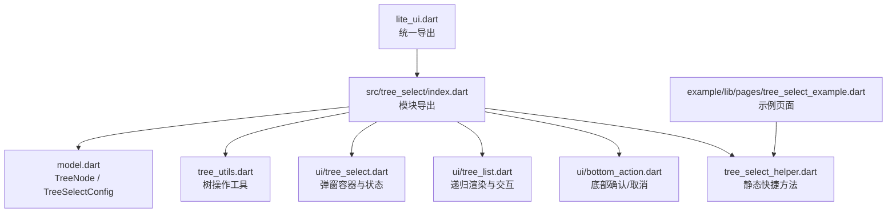
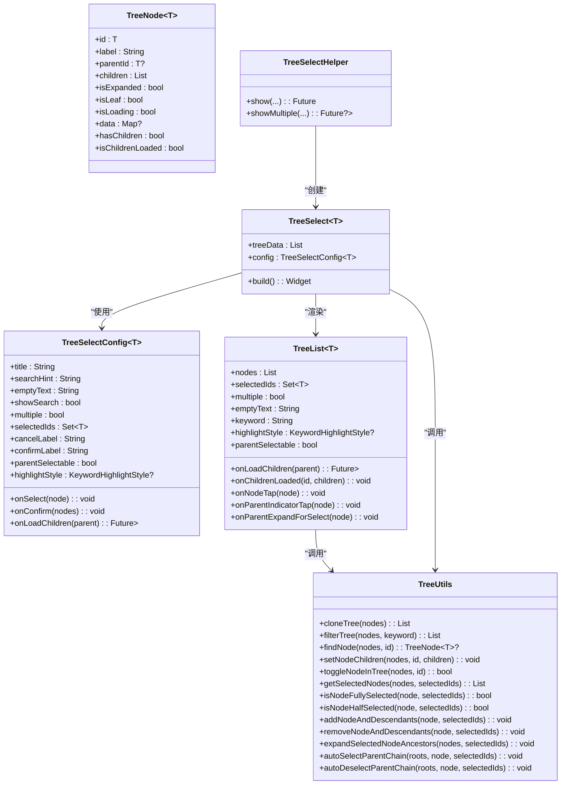
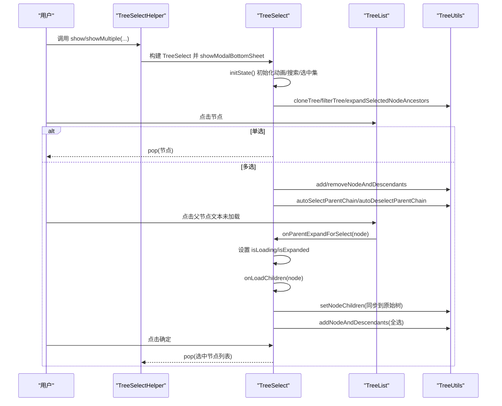
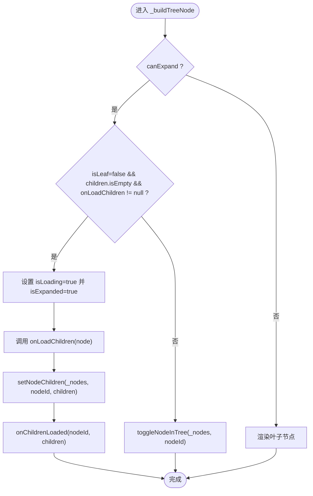
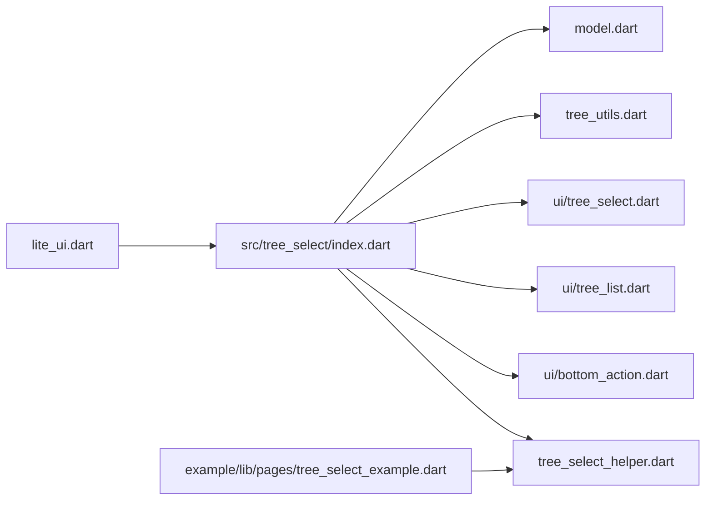

# 树形选择器

<cite>
**本文引用的文件**   
- [pubspec.yaml](file://pubspec.yaml)
- [README.md](file://README.md)
- [lite_ui.dart](file://lib/lite_ui.dart)
- [model.dart](file://lib/src/tree_select/model.dart)
- [tree_utils.dart](file://lib/src/tree_select/tree_utils.dart)
- [tree_select_helper.dart](file://lib/src/tree_select/tree_select_helper.dart)
- [ui/tree_select.dart](file://lib/src/tree_select/ui/tree_select.dart)
- [ui/tree_list.dart](file://lib/src/tree_select/ui/tree_list.dart)
- [ui/bottom_action.dart](file://lib/src/tree_select/ui/bottom_action.dart)
- [index.dart](file://lib/src/tree_select/index.dart)
- [tree_select_example.dart](file://example/lib/pages/tree_select_example.dart)
</cite>

## 目录
1. [简介](#简介)
2. [项目结构](#项目结构)
3. [核心组件](#核心组件)
4. [架构总览](#架构总览)
5. [详细组件分析](#详细组件分析)
6. [依赖关系分析](#依赖关系分析)
7. [性能与优化](#性能与优化)
8. [使用示例与最佳实践](#使用示例与最佳实践)
9. [API 参考](#api-参考)
10. [故障排查](#故障排查)
11. [结论](#结论)

## 简介
TreeSelect 是 Lite UI 提供的树形选择器组件，以底部弹出面板形式展示层级数据，支持搜索过滤、懒加载、多选联动、父节点可选等高级特性。通过 TreeSelectHelper 提供一行代码的便捷调用方式，适合组织架构选择、权限管理、分类导航等复杂业务场景。

## 项目结构
TreeSelect 相关源码位于 lib/src/tree_select 目录下，包含数据模型、工具类、UI 组件与便捷方法；示例页面位于 example/lib/pages 下。

图表来源
- [lite_ui.dart:1-19](file://lib/lite_ui.dart#L1-L19)
- [index.dart:1-6](file://lib/src/tree_select/index.dart#L1-L6)
- [model.dart:1-123](file://lib/src/tree_select/model.dart#L1-L123)
- [tree_utils.dart:1-243](file://lib/src/tree_select/tree_utils.dart#L1-L243)
- [ui/tree_select.dart:1-238](file://lib/src/tree_select/ui/tree_select.dart#L1-L238)
- [ui/tree_list.dart:1-291](file://lib/src/tree_select/ui/tree_list.dart#L1-L291)
- [ui/bottom_action.dart:1-52](file://lib/src/tree_select/ui/bottom_action.dart#L1-L52)
- [tree_select_helper.dart:1-119](file://lib/src/tree_select/tree_select_helper.dart#L1-L119)
- [tree_select_example.dart:1-351](file://example/lib/pages/tree_select_example.dart#L1-L351)

章节来源
- [pubspec.yaml:1-21](file://pubspec.yaml#L1-L21)
- [README.md:118-126](file://README.md#L118-L126)

## 核心组件
- TreeNode<T>：树节点数据模型，包含 id、label、parentId、children、isExpanded、isLeaf、isLoading、data 等属性，并提供 hasChildren、isChildrenLoaded 等便捷判断。
- TreeSelectConfig<T>：组件配置项，包括标题、搜索提示、空态文案、是否显示搜索框、是否多选、预选中 ID、回调（单选 onSelect、多选 onConfirm）、懒加载回调 onLoadChildren、按钮文案、父节点可选开关、关键字高亮样式等。
- TreeSelect<T>：弹窗容器与状态管理，负责动画、搜索过滤、选中逻辑、懒加载同步与 UI 组装。
- TreeList<T>：纯展示型树形列表，负责递归渲染、展开/折叠、懒加载触发、三态选择指示与子节点数量徽章。
- BottomAction：底部操作栏（仅多选模式），提供取消与确定按钮。
- TreeSelectHelper：静态便捷方法 show（单选）与 showMultiple（多选），封装 showModalBottomSheet 并传入 TreeSelect。
- TreeUtils：纯函数式树操作工具，提供深拷贝、过滤、查找、设置子节点、切换展开、统计、选中状态判断、批量选中/取消、祖先路径展开、自动联动父链等能力。

章节来源
- [model.dart:11-44](file://lib/src/tree_select/model.dart#L11-L44)
- [model.dart:59-122](file://lib/src/tree_select/model.dart#L59-L122)
- [ui/tree_select.dart:17-28](file://lib/src/tree_select/ui/tree_select.dart#L17-L28)
- [ui/tree_list.dart:21-78](file://lib/src/tree_select/ui/tree_list.dart#L21-L78)
- [ui/bottom_action.dart:5-8](file://lib/src/tree_select/ui/bottom_action.dart#L5-L8)
- [tree_select_helper.dart:11-13](file://lib/src/tree_select/tree_select_helper.dart#L11-L13)
- [tree_utils.dart:7-9](file://lib/src/tree_select/tree_utils.dart#L7-L9)

## 架构总览
TreeSelect 采用“弹窗容器 + 列表渲染 + 工具类”的分层设计：
- 入口：TreeSelectHelper.show/showMultiple 打开底部弹窗，构造 TreeSelect 实例。
- 状态：TreeSelectState 维护搜索词、选中集合、过滤后的树数据，处理点击与懒加载。
- 渲染：TreeList 递归渲染节点，处理展开/折叠、懒加载、三态选择指示与子节点计数。
- 工具：TreeUtils 提供无状态的树操作能力，保证数据不可变性与一致性。

图表来源
- [model.dart:11-44](file://lib/src/tree_select/model.dart#L11-L44)
- [model.dart:59-122](file://lib/src/tree_select/model.dart#L59-L122)
- [ui/tree_select.dart:17-28](file://lib/src/tree_select/ui/tree_select.dart#L17-L28)
- [ui/tree_list.dart:21-78](file://lib/src/tree_select/ui/tree_list.dart#L21-L78)
- [tree_select_helper.dart:11-13](file://lib/src/tree_select/tree_select_helper.dart#L11-L13)
- [tree_utils.dart:7-9](file://lib/src/tree_select/tree_utils.dart#L7-L9)

## 详细组件分析

### 数据模型与配置
- TreeNode<T> 字段说明：
  - id：唯一标识，泛型类型默认 String。
  - label：显示文本。
  - parentId：父节点 ID（根为 null）。
  - children：子节点列表。
  - isExpanded：UI 展开状态。
  - isLeaf：是否为叶子节点；false 且 children 为空表示待懒加载。
  - isLoading：懒加载中状态。
  - data：扩展字段。
  - hasChildren：存在子节点或待加载。
  - isChildrenLoaded：已为叶子或已有子节点。
- TreeSelectConfig<T> 关键参数：
  - title/searchHint/emptyText：标题、搜索提示、空态文案。
  - showSearch/multiple/parentSelectable：是否显示搜索、是否多选、是否允许父节点直接选中。
  - selectedIds：预选中 ID 集合。
  - onSelect/onConfirm：单选与多选回调。
  - onLoadChildren：懒加载回调。
  - cancelLabel/confirmLabel：按钮文案。
  - highlightStyle：关键字高亮样式。

章节来源
- [model.dart:11-44](file://lib/src/tree_select/model.dart#L11-L44)
- [model.dart:59-122](file://lib/src/tree_select/model.dart#L59-L122)

### TreeSelect 状态与流程
- 初始化：构建动画控制器、搜索控制器、克隆树数据、应用初始搜索、展开已选祖先路径。
- 更新：当 treeData 变化时重新克隆并应用当前关键词；selectedIds 变化时同步内部选中集合并展开祖先。
- 搜索：_applyFilter 根据关键词过滤树，返回克隆后的结果用于渲染。
- 选择逻辑：
  - 单选：点击即关闭并返回节点。
  - 多选：点击行联动全选/取消后代；若 parentSelectable=false 则向上联动父链；若 parentSelectable=true 且未加载，先触发懒加载再全选。
- 懒加载：TreeList 在展开时触发 onLoadChildren，完成后通过 onChildrenLoaded 同步回原始数据。

图表来源
- [tree_select_helper.dart:19-64](file://lib/src/tree_select/tree_select_helper.dart#L19-L64)
- [tree_select_helper.dart:72-117](file://lib/src/tree_select/tree_select_helper.dart#L72-L117)
- [ui/tree_select.dart:42-77](file://lib/src/tree_select/ui/tree_select.dart#L42-L77)
- [ui/tree_select.dart:88-95](file://lib/src/tree_select/ui/tree_select.dart#L88-L95)
- [ui/tree_select.dart:99-170](file://lib/src/tree_select/ui/tree_select.dart#L99-L170)
- [ui/tree_list.dart:115-141](file://lib/src/tree_select/ui/tree_list.dart#L115-L141)
- [tree_utils.dart:13-26](file://lib/src/tree_select/tree_utils.dart#L13-L26)
- [tree_utils.dart:29-50](file://lib/src/tree_select/tree_utils.dart#L29-L50)
- [tree_utils.dart:167-188](file://lib/src/tree_select/tree_utils.dart#L167-L188)
- [tree_utils.dart:208-241](file://lib/src/tree_select/tree_utils.dart#L208-L241)

### TreeList 渲染与交互
- 递归渲染：_buildTreeNode 按层级缩进渲染，支持展开/折叠箭头与 loading。
- 内容区域：文本高亮、子节点数量 badge、选择指示器（全选中/半选中/未选中）。
- 父节点行为：
  - parentSelectable=false：点击行展开/折叠；圆圈点击联动子节点。
  - parentSelectable=true：点击行在未加载时先触发懒加载再全选；圆圈点击仅切换父节点自身。
- 懒加载：展开时若 isLeaf=false 且 children 为空，调用 onLoadChildren，完成后 setNodeChildren 并通知 onChildrenLoaded。

图表来源
- [ui/tree_list.dart:145-191](file://lib/src/tree_select/ui/tree_list.dart#L145-L191)
- [ui/tree_list.dart:195-244](file://lib/src/tree_select/ui/tree_list.dart#L195-L244)
- [ui/tree_list.dart:115-141](file://lib/src/tree_select/ui/tree_list.dart#L115-L141)

### TreeUtils 工具能力
- 树操作：cloneTree、filterTree、findNode、setNodeChildren、toggleNodeInTree。
- 统计与查询：countDescendants、countSelectedDescendants、getSelectedNodes。
- 选中状态：isNodeFullySelected、isNodeHalfSelected、hasAnyDescendantSelected。
- 批量操作：addNodeAndDescendants、removeNodeAndDescendants。
- 展开与联动：expandSelectedNodeAncestors、autoSelectParentChain、autoDeselectParentChain。

章节来源
- [tree_utils.dart:13-26](file://lib/src/tree_select/tree_utils.dart#L13-L26)
- [tree_utils.dart:29-50](file://lib/src/tree_select/tree_utils.dart#L29-L50)
- [tree_utils.dart:53-71](file://lib/src/tree_select/tree_utils.dart#L53-L71)
- [tree_utils.dart:89-118](file://lib/src/tree_select/tree_utils.dart#L89-L118)
- [tree_utils.dart:122-145](file://lib/src/tree_select/tree_utils.dart#L122-L145)
- [tree_utils.dart:149-163](file://lib/src/tree_select/tree_utils.dart#L149-L163)
- [tree_utils.dart:167-188](file://lib/src/tree_select/tree_utils.dart#L167-L188)
- [tree_utils.dart:208-241](file://lib/src/tree_select/tree_utils.dart#L208-L241)

### TreeSelectHelper 便捷方法
- show<T>：单选模式，选中后自动关闭并返回节点，取消返回 null。
- showMultiple<T>：多选模式，点击确定关闭并返回选中节点列表，取消返回 null。
- 两者均支持 title、searchHint、emptyText、showSearch、parentSelectable、selectedId(s)、onSelect/onConfirm、onLoadChildren、按钮文案、高亮样式等参数。

章节来源
- [tree_select_helper.dart:19-64](file://lib/src/tree_select/tree_select_helper.dart#L19-L64)
- [tree_select_helper.dart:72-117](file://lib/src/tree_select/tree_select_helper.dart#L72-L117)

## 依赖关系分析
- lite_ui.dart 统一导出 tree_select 模块，便于外部引入。
- TreeSelect 依赖 TreeList、BottomAction、TreeUtils 与 model 中的配置与回调类型。
- TreeList 依赖 TreeUtils 进行树操作与状态计算。
- TreeSelectHelper 依赖 TreeSelect 与 model 中的配置类型。

图表来源
- [lite_ui.dart:1-19](file://lib/lite_ui.dart#L1-L19)
- [index.dart:1-6](file://lib/src/tree_select/index.dart#L1-L6)

章节来源
- [lite_ui.dart:1-19](file://lib/lite_ui.dart#L1-L19)
- [index.dart:1-6](file://lib/src/tree_select/index.dart#L1-L6)

## 性能与优化
- 数据克隆与过滤：每次搜索或数据源变化时 cloneTree + filterTree，避免修改原始数据，但会产生额外内存开销。建议在大数据量场景结合分页或虚拟滚动策略。
- 懒加载：仅在展开时加载子节点，减少首屏渲染压力；配合缓存机制可避免重复请求。
- 选中状态计算：TreeUtils 的递归遍历在深层级树中可能带来 O(n) 复杂度，建议控制树深度与分支数，或在业务层对频繁操作进行局部缓存。
- 渲染优化：TreeList 使用 ListView.builder 按需构建节点；对于超大数据集，可考虑将节点渲染拆分为独立 Stateful 组件并使用 const 或 key 提升重建效率。
- 动画与交互：SlideTransition 与 AnimatedRotation 轻量动画，注意在低端设备上避免过多并发动画。

[本节为通用指导，不直接分析具体文件]

## 使用示例与最佳实践
- 示例页面展示了单选、多选、懒加载等多种用法，以及父节点可选/不可选的差异。
- 推荐做法：
  - 使用 TreeSelectHelper 快速弹出选择器，减少样板代码。
  - 合理设置 parentSelectable：仅叶子可选时用户体验更清晰；需要部门/人员混合选择时可开启父节点可选。
  - 懒加载回调需稳定返回子节点列表，并在异常时保持 isLoading=false。
  - 搜索关键词长度与匹配规则可根据业务调整，必要时增加防抖。
  - 多选模式下，利用 onConfirm 回调获取最终选中节点列表，避免中间状态不一致。

章节来源
- [tree_select_example.dart:165-201](file://example/lib/pages/tree_select_example.dart#L165-L201)
- [tree_select_example.dart:210-246](file://example/lib/pages/tree_select_example.dart#L210-L246)
- [tree_select_example.dart:255-293](file://example/lib/pages/tree_select_example.dart#L255-L293)

## API 参考

### TreeSelectConfig<T> 配置项
- title：主标题
- searchHint：搜索框提示
- emptyText：空状态提示
- showSearch：是否显示搜索框
- multiple：是否多选
- selectedIds：预选中 ID 集合
- onSelect：单选点击回调
- onConfirm：多选确认回调
- onLoadChildren：懒加载回调
- cancelLabel：取消按钮文案
- confirmLabel：确定按钮文案
- parentSelectable：是否允许父节点直接选中
- highlightStyle：关键字高亮样式

章节来源
- [model.dart:59-122](file://lib/src/tree_select/model.dart#L59-L122)

### TreeSelect<T> 组件
- 输入：treeData、config
- 行为：搜索过滤、单选/多选、懒加载、动画展开
- 事件：由 config 中的 onSelect/onConfirm/onLoadChildren 驱动

章节来源
- [ui/tree_select.dart:17-28](file://lib/src/tree_select/ui/tree_select.dart#L17-L28)
- [ui/tree_select.dart:88-95](file://lib/src/tree_select/ui/tree_select.dart#L88-L95)
- [ui/tree_select.dart:99-170](file://lib/src/tree_select/ui/tree_select.dart#L99-L170)

### TreeList<T> 组件
- 输入：nodes、selectedIds、multiple、emptyText、onLoadChildren、onChildrenLoaded、onNodeTap、keyword、highlightStyle、parentSelectable、onParentIndicatorTap、onParentExpandForSelect
- 行为：递归渲染、展开/折叠、懒加载、三态选择指示、子节点数量徽章

章节来源
- [ui/tree_list.dart:21-78](file://lib/src/tree_select/ui/tree_list.dart#L21-L78)
- [ui/tree_list.dart:115-141](file://lib/src/tree_select/ui/tree_list.dart#L115-L141)
- [ui/tree_list.dart:195-244](file://lib/src/tree_select/ui/tree_list.dart#L195-L244)

### TreeSelectHelper 静态方法
- show<T>(...)：弹出单选树形选择器，返回 TreeNode<T>?
- showMultiple<T>(...)：弹出多选树形选择器，返回 List<TreeNode<T>>?

章节来源
- [tree_select_helper.dart:19-64](file://lib/src/tree_select/tree_select_helper.dart#L19-L64)
- [tree_select_helper.dart:72-117](file://lib/src/tree_select/tree_select_helper.dart#L72-L117)

### TreeUtils 工具方法
- cloneTree、filterTree、findNode、setNodeChildren、toggleNodeInTree
- countDescendants、countSelectedDescendants、getSelectedNodes
- isNodeFullySelected、isNodeHalfSelected、hasAnyDescendantSelected
- addNodeAndDescendants、removeNodeAndDescendants
- expandSelectedNodeAncestors、autoSelectParentChain、autoDeselectParentChain

章节来源
- [tree_utils.dart:13-26](file://lib/src/tree_select/tree_utils.dart#L13-L26)
- [tree_utils.dart:29-50](file://lib/src/tree_select/tree_utils.dart#L29-L50)
- [tree_utils.dart:53-71](file://lib/src/tree_select/tree_utils.dart#L53-L71)
- [tree_utils.dart:89-118](file://lib/src/tree_select/tree_utils.dart#L89-L118)
- [tree_utils.dart:122-145](file://lib/src/tree_select/tree_utils.dart#L122-L145)
- [tree_utils.dart:149-163](file://lib/src/tree_select/tree_utils.dart#L149-L163)
- [tree_utils.dart:167-188](file://lib/src/tree_select/tree_utils.dart#L167-L188)
- [tree_utils.dart:208-241](file://lib/src/tree_select/tree_utils.dart#L208-L241)

## 故障排查
- 搜索无结果：检查 keyword 大小写与 label 匹配逻辑；确保 filterTree 正确克隆与过滤。
- 懒加载不触发：确认 isLeaf=false 且 children 为空，且 onLoadChildren 已传入；检查 isLoading 状态是否正确重置。
- 父节点联动异常：parentSelectable=false 时，确保 autoSelectParentChain/autoDeselectParentChain 被调用；parentSelectable=true 时，区分行点击与圆圈点击逻辑。
- 选中状态不同步：确保 onChildrenLoaded 同步原始树数据；selectedIds 变化时重新展开祖先路径。
- 性能问题：大数据量时考虑分页、虚拟滚动、减少不必要的 setState 与深拷贝频率。

章节来源
- [ui/tree_select.dart:88-95](file://lib/src/tree_select/ui/tree_select.dart#L88-L95)
- [ui/tree_select.dart:99-170](file://lib/src/tree_select/ui/tree_select.dart#L99-L170)
- [ui/tree_list.dart:115-141](file://lib/src/tree_select/ui/tree_list.dart#L115-L141)
- [tree_utils.dart:167-188](file://lib/src/tree_select/tree_utils.dart#L167-L188)
- [tree_utils.dart:208-241](file://lib/src/tree_select/tree_utils.dart#L208-L241)

## 结论
TreeSelect 通过清晰的模块化设计与强大的工具类，提供了完整的树形选择能力，覆盖单选/多选、懒加载、搜索高亮、父子联动等常见需求。借助 TreeSelectHelper 的便捷接口，开发者可以快速集成并适配多种业务场景。在实际使用中，应关注数据规模与交互复杂度，结合懒加载、缓存与渲染优化策略，以获得更好的性能与用户体验。