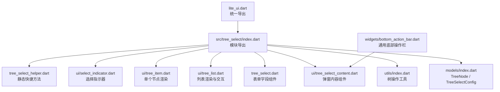
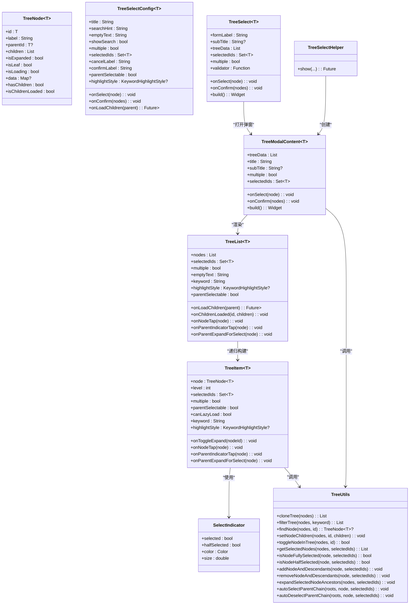
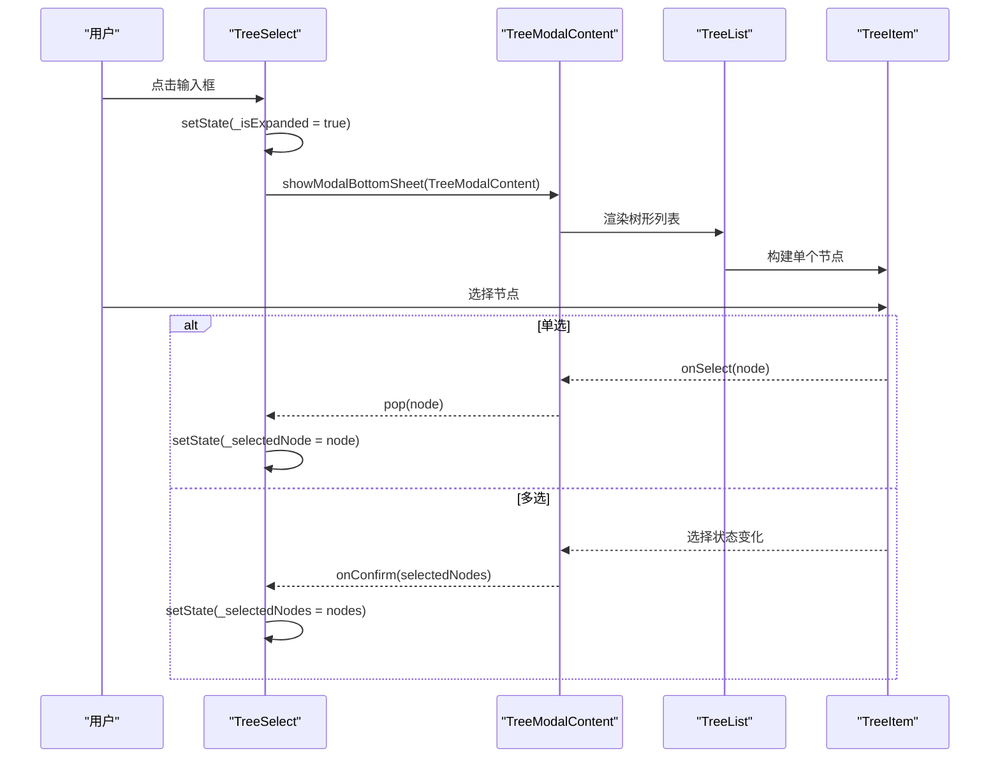
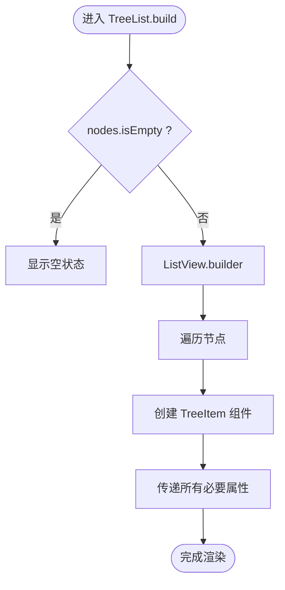
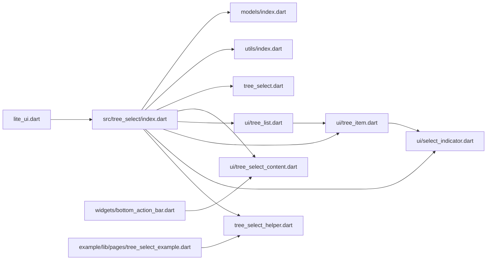

# 树形选择器

<cite>
**本文引用的文件**   
- [pubspec.yaml](file://pubspec.yaml)
- [README.md](file://README.md)
- [lite_ui.dart](file://lib/lite_ui.dart)
- [models/index.dart](file://lib/src/tree_select/models/index.dart)
- [utils/index.dart](file://lib/src/tree_select/utils/index.dart)
- [tree_select_helper.dart](file://lib/src/tree_select/tree_select_helper.dart)
- [tree_select.dart](file://lib/src/tree_select/tree_select.dart)
- [ui/tree_select_content.dart](file://lib/src/tree_select/ui/tree_select_content.dart)
- [ui/tree_list.dart](file://lib/src/tree_select/ui/tree_list.dart)
- [ui/tree_item.dart](file://lib/src/tree_select/ui/tree_item.dart)
- [ui/select_indicator.dart](file://lib/src/tree_select/ui/select_indicator.dart)
- [index.dart](file://lib/src/tree_select/index.dart)
- [bottom_action_bar.dart](file://lib/src/widgets/bottom_action_bar.dart)
</cite>

## 更新摘要
**变更内容**   
- **重大重构**：tree_list.dart被拆分为tree_item.dart和select_indicator.dart两个独立组件，增强了代码组织和可维护性
- **新增TreeItem组件**：专门处理单个树节点的渲染逻辑，包含层级连接线、子节点数量徽章、选择指示器等UI元素
- **新增SelectIndicator组件**：实现三态选择指示器（全选/半选/未选），提供统一的视觉反馈
- **增强subtitle支持**：TreeModalContent组件现在支持副标题显示功能
- **职责分离**：TreeList专注于列表渲染和懒加载，TreeItem专注于单个节点展示，SelectIndicator专注于选择状态可视化

## 目录
1. [简介](#简介)
2. [项目结构](#项目结构)
3. [核心组件](#核心组件)
4. [架构总览](#架构总览)
5. [详细组件分析](#详细组件分析)
6. [依赖关系分析](#依赖关系分析)
7. [性能与优化](#性能与优化)
8. [使用示例与最佳实践](#使用示例与最佳实践)
9. [API 参考](#api-参考)
10. [故障排查](#故障排查)
11. [结论](#结论)

## 简介
TreeSelect 是 Lite UI 提供的树形选择器组件，现已完成重大架构重构。新版本采用"表单字段组件 + 弹窗内容"的分层设计，提供统一的 API 接口和增强的表单集成能力。支持底部弹出面板展示层级数据，具备搜索过滤、懒加载、多选联动、父节点可选等高级特性。通过 TreeSelectHelper 提供一行代码的便捷调用方式，适合组织架构选择、权限管理、分类导航等复杂业务场景。

**最新改进**：组件架构进一步细化，将树节点渲染逻辑从 TreeList 中分离出来，形成了更加清晰的职责分工，提升了代码的可维护性和复用性。

## 项目结构
TreeSelect 相关源码位于 lib/src/tree_select 目录下，包含数据模型、工具类、UI 组件与便捷方法；示例页面位于 example/lib/pages 下。

图表来源
- [lite_ui.dart:1-19](file://lib/lite_ui.dart#L1-L19)
- [index.dart:1-7](file://lib/src/tree_select/index.dart#L1-L7)
- [models/index.dart:1-123](file://lib/src/tree_select/models/index.dart#L1-L123)
- [utils/index.dart:1-243](file://lib/src/tree_select/utils/index.dart#L1-L243)
- [tree_select.dart:1-430](file://lib/src/tree_select/tree_select.dart#L1-L430)
- [ui/tree_select_content.dart:1-325](file://lib/src/tree_select/ui/tree_select_content.dart#L1-L325)
- [ui/tree_list.dart:1-156](file://lib/src/tree_select/ui/tree_list.dart#L1-L156)
- [ui/tree_item.dart:1-232](file://lib/src/tree_select/ui/tree_item.dart#L1-L232)
- [ui/select_indicator.dart:1-38](file://lib/src/tree_select/ui/select_indicator.dart#L1-L38)
- [tree_select_helper.dart:1-81](file://lib/src/tree_select/tree_select_helper.dart#L1-L81)
- [bottom_action_bar.dart:1-135](file://lib/src/widgets/bottom_action_bar.dart#L1-L135)

章节来源
- [pubspec.yaml:1-21](file://pubspec.yaml#L1-L21)
- [README.md:118-126](file://README.md#L118-L126)

## 核心组件
- TreeNode<T>：树节点数据模型，包含 id、label、parentId、children、isExpanded、isLeaf、isLoading、data 等属性，并提供 hasChildren、isChildrenLoaded 等便捷判断。
- TreeSelectConfig<T>：组件配置项，包括标题、搜索提示、空态文案、是否显示搜索框、是否多选、预选中 ID、回调（单选 onSelect、多选 onConfirm）、懒加载回调 onLoadChildren、按钮文案、父节点可选开关、关键字高亮样式等。
- **TreeSelect<T>**：表单字段组件，继承 StatefulWidget + FormField，提供默认 UI 和表单集成能力。
- **TreeModalContent<T>**：弹窗内容组件，负责树形列表展示、搜索过滤、选择逻辑和懒加载。
- **TreeList<T>**：纯展示型树形列表，负责递归渲染、展开/折叠、懒加载触发、三态选择指示与子节点数量徽章。
- **TreeItem<T>**：**新增** 专门处理单个树节点渲染的组件，包含层级连接线、子节点数量徽章、选择指示器等完整UI逻辑。
- **SelectIndicator**：**新增** 三态选择指示器组件，实现全选、半选、未选的视觉反馈。
- **BottomActionBar**：通用底部操作栏组件，提供已选数量展示、空选禁用确认等增强功能。
- TreeSelectHelper：静态便捷方法 show，统一支持单选和多选模式，封装 showModalBottomSheet 并传入 TreeModalContent。
- TreeUtils：纯函数式树操作工具，提供深拷贝、过滤、查找、设置子节点、切换展开、统计、选中状态判断、批量选中/取消、祖先路径展开、自动联动父链等能力。

章节来源
- [models/index.dart:11-44](file://lib/src/tree_select/models/index.dart#L11-L44)
- [models/index.dart:59-122](file://lib/src/tree_select/models/index.dart#L59-L122)
- [tree_select.dart:26-172](file://lib/src/tree_select/tree_select.dart#L26-L172)
- [ui/tree_select_content.dart:19-102](file://lib/src/tree_select/ui/tree_select_content.dart#L19-L102)
- [ui/tree_list.dart:21-78](file://lib/src/tree_select/ui/tree_list.dart#L21-L78)
- [ui/tree_item.dart:14-65](file://lib/src/tree_select/ui/tree_item.dart#L14-L65)
- [ui/select_indicator.dart:9-22](file://lib/src/tree_select/ui/select_indicator.dart#L9-L22)
- [bottom_action_bar.dart:6-46](file://lib/src/widgets/bottom_action_bar.dart#L6-L46)
- [tree_select_helper.dart:11-13](file://lib/src/tree_select/tree_select_helper.dart#L11-L13)
- [utils/index.dart:7-9](file://lib/src/tree_select/utils/index.dart#L7-L9)

## 架构总览
TreeSelect 采用"表单字段 + 弹窗内容 + 工具类"的分层设计，经过重构后形成了更加清晰的组件层次：
- 入口：TreeSelectHelper.show 打开底部弹窗，构造 TreeModalContent 实例。
- 表单层：TreeSelectField 集成 FormField，处理表单校验、值同步和 WrapperContainer 包装。
- 弹窗层：TreeModalContent 管理搜索、选中状态、懒加载和 UI 组装。
- 列表层：TreeList 负责节点列表的递归渲染和懒加载控制。
- 节点层：**新增** TreeItem 专门处理单个节点的完整渲染逻辑。
- 指示器层：**新增** SelectIndicator 提供统一的选择状态可视化。
- 工具层：TreeUtils 提供无状态的树操作能力，保证数据不可变性与一致性。

图表来源
- [models/index.dart:11-44](file://lib/src/tree_select/models/index.dart#L11-L44)
- [models/index.dart:59-122](file://lib/src/tree_select/models/index.dart#L59-L122)
- [tree_select.dart:26-172](file://lib/src/tree_select/tree_select.dart#L26-L172)
- [ui/tree_select_content.dart:19-102](file://lib/src/tree_select/ui/tree_select_content.dart#L19-L102)
- [ui/tree_list.dart:21-78](file://lib/src/tree_select/ui/tree_list.dart#L21-L78)
- [ui/tree_item.dart:14-65](file://lib/src/tree_select/ui/tree_item.dart#L14-L65)
- [ui/select_indicator.dart:9-22](file://lib/src/tree_select/ui/select_indicator.dart#L9-L22)
- [tree_select_helper.dart:11-13](file://lib/src/tree_select/tree_select_helper.dart#L11-L13)
- [utils/index.dart:7-9](file://lib/src/tree_select/utils/index.dart#L7-L9)

## 详细组件分析

### 数据模型与配置
- TreeNode<T> 字段说明：
  - id：唯一标识，泛型类型默认 String。
  - label：显示文本。
  - parentId：父节点 ID（根为 null）。
  - children：子节点列表。
  - isExpanded：UI 展开状态。
  - isLeaf：是否为叶子节点；false 且 children 为空表示待懒加载。
  - isLoading：懒加载中状态。
  - data：扩展字段。
  - hasChildren：存在子节点或待加载。
  - isChildrenLoaded：已为叶子或已有子节点。
- TreeSelectConfig<T> 关键参数：
  - title/searchHint/emptyText：标题、搜索提示、空态文案。
  - showSearch/multiple/parentSelectable：是否显示搜索、是否多选、是否允许父节点直接选中。
  - selectedIds：预选中 ID 集合。
  - onSelect/onConfirm：单选与多选回调。
  - onLoadChildren：懒加载回调。
  - cancelLabel/confirmLabel：按钮文案。
  - highlightStyle：关键字高亮样式。

章节来源
- [models/index.dart:11-44](file://lib/src/tree_select/models/index.dart#L11-L44)
- [models/index.dart:59-122](file://lib/src/tree_select/models/index.dart#L59-L122)

### TreeSelect 表单组件
TreeSelect 现在是表单字段组件，继承 StatefulWidget + FormField，提供完整的表单集成能力：

- 表单属性：formLabel、subTitle、hintText、required、formLayout、prefixIcon、displayMode、maxShowTags 等。
- 值管理：支持单选和多选模式的值同步，内置 _syncFromExternalIds 方法处理外部 selectedIds 变化。
- 校验机制：集成 validator 函数和 AutovalidateMode，支持必填校验和自定义验证规则。
- 值显示：支持 text、compact、custom 三种显示模式，可通过 valueBuilder 自定义渲染。
- 弹窗集成：点击后打开 TreeModalContent 弹窗，根据 multiple 属性区分单选/多选流程。

**更新** 验证消息统一化：默认验证规则已从"是必填项不能为空"改为"是必选项不能为空"，提供更准确的术语用于树形选择场景。

图表来源
- [tree_select.dart:174-430](file://lib/src/tree_select/tree_select.dart#L174-L430)
- [ui/tree_select_content.dart:104-325](file://lib/src/tree_select/ui/tree_select_content.dart#L104-L325)
- [ui/tree_list.dart:80-156](file://lib/src/tree_select/ui/tree_list.dart#L80-L156)
- [ui/tree_item.dart:67-232](file://lib/src/tree_select/ui/tree_item.dart#L67-L232)

### TreeModalContent 弹窗内容
专注弹窗内容展示的组件，**增强subtitle支持**：

- 状态管理：维护搜索控制器、选中 ID 集合、过滤后的树数据。
- 搜索过滤：_applyFilter 方法根据关键词过滤树，返回克隆后的结果用于渲染。
- 选择逻辑：
  - 单选：点击即关闭并返回节点。
  - 多选：点击行联动全选/取消后代；若 parentSelectable=false 则向上联动父链；若 parentSelectable=true 且未加载，先触发懒加载再全选。
- 懒加载：TreeList 在展开时触发 onLoadChildren，完成后通过 onChildrenLoaded 同步回原始数据。
- 底部操作：使用 BottomActionBar 组件，支持已选数量展示和空选禁用确认。
- **subtitle支持**：现在支持 subTitle 参数，用于显示额外的描述信息。

### TreeList 渲染与交互
**重构后** 专注于列表渲染和懒加载控制，节点渲染委托给 TreeItem：

- 递归渲染：通过 TreeItem 组件按层级缩进渲染，支持展开/折叠箭头与 loading。
- 懒加载：在展开时若 isLeaf=false 且 children 为空，调用 onLoadChildren，完成后 setNodeChildren 并通知 onChildrenLoaded。
- 事件处理：统一管理展开/折叠、节点点击、父节点选择等操作。

图表来源
- [ui/tree_list.dart:98-124](file://lib/src/tree_select/ui/tree_list.dart#L98-L124)
- [ui/tree_list.dart:126-155](file://lib/src/tree_select/ui/tree_list.dart#L126-L155)

### TreeItem 节点渲染组件
**新增** 专门处理单个树节点渲染的组件：

- 节点信息：接收 TreeNode、层级 level、选中状态、多选模式等属性。
- 展开逻辑：根据 canExpand 判断是否显示展开箭头，处理展开/折叠动画。
- 内容区域：文本高亮、子节点数量 badge、选择指示器（全选中/半选中/未选中）。
- 父节点行为：
  - parentSelectable=false：点击行展开/折叠；圆圈点击联动子节点。
  - parentSelectable=true：点击行在未加载时先触发懒加载再全选；圆圈点击仅切换父节点自身。
- 层级连接线：展开时绘制垂直线和横向连接线，形成清晰的树形结构。

**更新** 增强了 subtitle 支持，现在可以显示更丰富的节点信息。

### SelectIndicator 选择指示器
**新增** 三态选择指示器组件：

- 全选状态：selected=true 时显示实心主色圆 + 白色对勾图标。
- 半选状态：halfSelected=true 时显示实心主色圆 + 白色横线图标。
- 未选状态：两者都为 false 时显示灰色空心圆环。
- 可定制：支持自定义颜色和尺寸，适配不同的主题需求。

### TreeUtils 工具能力
- 树操作：cloneTree、filterTree、findNode、setNodeChildren、toggleNodeInTree。
- 统计与查询：countDescendants、countSelectedDescendants、getSelectedNodes。
- 选中状态：isNodeFullySelected、isNodeHalfSelected、hasAnyDescendantSelected。
- 批量操作：addNodeAndDescendants、removeNodeAndDescendants。
- 展开与联动：expandSelectedNodeAncestors、autoSelectParentChain、autoDeselectParentChain。

章节来源
- [utils/index.dart:13-26](file://lib/src/tree_select/utils/index.dart#L13-L26)
- [utils/index.dart:29-50](file://lib/src/tree_select/utils/index.dart#L29-L50)
- [utils/index.dart:53-71](file://lib/src/tree_select/utils/index.dart#L53-L71)
- [utils/index.dart:89-118](file://lib/src/tree_select/utils/index.dart#L89-L118)
- [utils/index.dart:122-145](file://lib/src/tree_select/utils/index.dart#L122-L145)
- [utils/index.dart:149-163](file://lib/src/tree_select/utils/index.dart#L149-L163)
- [utils/index.dart:167-188](file://lib/src/tree_select/utils/index.dart#L167-L188)
- [utils/index.dart:208-241](file://lib/src/tree_select/utils/index.dart#L208-L241)

### TreeSelectHelper 便捷方法
统一的 show 方法，通过 multiple 参数区分单选和多选模式：

- show<T>：统一入口方法，支持单选和多选模式。
  - 单选模式（multiple = false）：选中节点后自动关闭，返回该节点，取消返回 null。
  - 多选模式（multiple = true）：通过 onConfirm 回调返回选中节点列表。
- 支持所有配置参数：title、searchHint、emptyText、showSearch、parentSelectable、selectedIds、onSelect/onConfirm、onLoadChildren、按钮文案、高亮样式等。

章节来源
- [tree_select_helper.dart:20-77](file://lib/src/tree_select/tree_select_helper.dart#L20-L77)

### BottomActionBar 复用
底部操作栏现在复用通用的 BottomActionBar 组件：

- 已选数量展示：selectedCount 参数显示当前选中节点数量。
- 空选禁用确认：disableWhenEmpty 参数控制当没有选中项时禁用确认按钮。
- 查看已选项：onViewSelected 回调支持点击已选数量查看详细信息。
- 样式定制：支持 confirmButtonColor、confirmButtonTextColor、cancelButtonColor 等颜色配置。

章节来源
- [bottom_action_bar.dart:6-46](file://lib/src/widgets/bottom_action_bar.dart#L6-L46)
- [ui/tree_select_content.dart:295-305](file://lib/src/tree_select/ui/tree_select_content.dart#L295-L305)

## 依赖关系分析
- lite_ui.dart 统一导出 tree_select 模块，便于外部引入。
- TreeSelect 依赖 TreeModalContent、TreeList、WrapperContainer 与 model 中的配置与回调类型。
- TreeModalContent 依赖 TreeList、BottomActionBar、TreeUtils 与 model 中的配置与回调类型。
- TreeList 依赖 TreeItem、TreeUtils 进行节点渲染与状态计算。
- TreeItem 依赖 SelectIndicator、TreeUtils 进行选择状态展示与计算。
- TreeSelectHelper 依赖 TreeModalContent 与 model 中的配置类型。

图表来源
- [lite_ui.dart:1-19](file://lib/lite_ui.dart#L1-L19)
- [index.dart:1-7](file://lib/src/tree_select/index.dart#L1-L7)

章节来源
- [lite_ui.dart:1-19](file://lib/lite_ui.dart#L1-L19)
- [index.dart:1-7](file://lib/src/tree_select/index.dart#L1-L7)

## 性能与优化
- 数据克隆与过滤：每次搜索或数据源变化时 cloneTree + filterTree，避免修改原始数据，但会产生额外内存开销。建议在大数据量场景结合分页或虚拟滚动策略。
- 懒加载：仅在展开时加载子节点，减少首屏渲染压力；配合缓存机制可避免重复请求。
- 选中状态计算：TreeUtils 的递归遍历在深层级树中可能带来 O(n) 复杂度，建议控制树深度与分支数，或在业务层对频繁操作进行局部缓存。
- 渲染优化：TreeList 使用 ListView.builder 按需构建节点；对于超大数据集，可考虑将节点渲染拆分为独立 Stateful 组件并使用 const 或 key 提升重建效率。
- **组件拆分优化**：TreeItem 和 SelectIndicator 的拆分使得每个组件的职责更加单一，减少了不必要的重建范围，提升了整体性能。
- 动画与交互：SlideTransition 与 AnimatedRotation 轻量动画，注意在低端设备上避免过多并发动画。
- **表单优化**：TreeSelectField 使用 FormField 的 didChange 和 onSaved 机制，确保表单状态与 UI 同步，避免不必要的重建。

[本节为通用指导，不直接分析具体文件]

## 使用示例与最佳实践
- **表单集成**：推荐使用 TreeSelect 表单组件，利用 FormField 的校验和保存功能。
- **便捷调用**：使用 TreeSelectHelper.show 快速弹出选择器，减少样板代码。
- **模式选择**：合理设置 multiple 参数，单选模式用户体验更简洁，多选模式适合批量操作。
- **父节点配置**：parentSelectable=false 时用户体验更清晰；需要部门/人员混合选择时可开启父节点可选。
- **懒加载优化**：懒加载回调需稳定返回子节点列表，并在异常时保持 isLoading=false。
- **搜索优化**：搜索关键词长度与匹配规则可根据业务调整，必要时增加防抖。
- **值显示定制**：利用 displayMode 和 valueBuilder 自定义选中值的显示样式。
- **验证消息统一**：系统已统一使用"是必选项不能为空"的验证提示，确保用户体验的一致性。
- **subtitle使用**：在需要显示额外信息的场景中，合理使用 subTitle 参数提供更好的用户体验。

章节来源
- [tree_select.dart:18-25](file://lib/src/tree_select/tree_select.dart#L18-L25)
- [tree_select_helper.dart:14-41](file://lib/src/tree_select/tree_select_helper.dart#L14-L41)

## API 参考

### TreeSelect<T> 表单组件
完整的表单字段组件，支持丰富的配置选项：

- 表单属性：formLabel、subTitle、hintText、required、formLayout、prefixIcon、displayMode、maxShowTags。
- 数据绑定：treeData、selectedIds、multiple、parentSelectable。
- 交互配置：showSearch、searchHint、emptyText、onLoadChildren、highlightStyle。
- 弹窗样式：title、cancelLabel、confirmLabel、searchButtonColor、confirmButtonColor、cancelButtonColor。
- 表单集成：validator、autovalidateMode、onSaved。
- 回调函数：onSelect（单选）、onConfirm（多选）、onClear。

**更新** 验证规则：defaultValid 方法已更新为使用"是必选项不能为空"的统一提示语，提供更准确的表单验证反馈。

章节来源
- [tree_select.dart:26-172](file://lib/src/tree_select/tree_select.dart#L26-L172)
- [tree_select.dart:257-272](file://lib/src/tree_select/tree_select.dart#L257-L272)

### TreeModalContent<T> 弹窗内容
专注弹窗内容展示的组件，**增强subtitle支持**：

- 数据输入：treeData、selectedIds、multiple、parentSelectable。
- 交互配置：showSearch、searchHint、emptyText、onLoadChildren、highlightStyle。
- 样式配置：title、subTitle、cancelLabel、confirmLabel、各种按钮颜色。
- 回调函数：onSelect（单选）、onConfirm（多选）。

章节来源
- [ui/tree_select_content.dart:19-102](file://lib/src/tree_select/ui/tree_select_content.dart#L19-L102)

### TreeList<T> 组件
**重构后** 专注于列表渲染和懒加载控制：

- 输入：nodes、selectedIds、multiple、emptyText、onLoadChildren、onChildrenLoaded、onNodeTap、keyword、highlightStyle、parentSelectable、onParentIndicatorTap、onParentExpandForSelect。
- 行为：递归渲染、展开/折叠、懒加载、委托 TreeItem 进行节点渲染。

章节来源
- [ui/tree_list.dart:21-78](file://lib/src/tree_select/ui/tree_list.dart#L21-L78)
- [ui/tree_list.dart:98-124](file://lib/src/tree_select/ui/tree_list.dart#L98-L124)
- [ui/tree_list.dart:126-155](file://lib/src/tree_select/ui/tree_list.dart#L126-L155)

### TreeItem<T> 节点组件
**新增** 专门处理单个树节点渲染的组件：

- 输入：node、level、selectedIds、multiple、parentSelectable、canLazyLoad、keyword、highlightStyle。
- 回调：onToggleExpand、onNodeTap、onParentIndicatorTap、onParentExpandForSelect。
- 功能：展开/折叠、文本高亮、子节点数量徽章、选择指示器、层级连接线。

章节来源
- [ui/tree_item.dart:14-65](file://lib/src/tree_select/ui/tree_item.dart#L14-L65)
- [ui/tree_item.dart:67-232](file://lib/src/tree_select/ui/tree_item.dart#L67-L232)

### SelectIndicator 选择指示器
**新增** 三态选择指示器组件：

- 输入：selected、halfSelected、color、size。
- 功能：全选、半选、未选三种状态的视觉反馈。

章节来源
- [ui/select_indicator.dart:9-22](file://lib/src/tree_select/ui/select_indicator.dart#L9-L22)
- [ui/select_indicator.dart:24-37](file://lib/src/tree_select/ui/select_indicator.dart#L24-L37)

### TreeSelectHelper 静态方法
统一的 show 方法：

- show<T>(...)：统一入口，支持单选和多选模式，返回 TreeNode<T>?。

章节来源
- [tree_select_helper.dart:20-77](file://lib/src/tree_select/tree_select_helper.dart#L20-L77)

### TreeUtils 工具方法
- cloneTree、filterTree、findNode、setNodeChildren、toggleNodeInTree。
- countDescendants、countSelectedDescendants、getSelectedNodes。
- isNodeFullySelected、isNodeHalfSelected、hasAnyDescendantSelected。
- addNodeAndDescendants、removeNodeAndDescendants。
- expandSelectedNodeAncestors、autoSelectParentChain、autoDeselectParentChain。

章节来源
- [utils/index.dart:13-26](file://lib/src/tree_select/utils/index.dart#L13-L26)
- [utils/index.dart:29-50](file://lib/src/tree_select/utils/index.dart#L29-L50)
- [utils/index.dart:53-71](file://lib/src/tree_select/utils/index.dart#L53-L71)
- [utils/index.dart:89-118](file://lib/src/tree_select/utils/index.dart#L89-L118)
- [utils/index.dart:122-145](file://lib/src/tree_select/utils/index.dart#L122-L145)
- [utils/index.dart:149-163](file://lib/src/tree_select/utils/index.dart#L149-L163)
- [utils/index.dart:167-188](file://lib/src/tree_select/utils/index.dart#L167-L188)
- [utils/index.dart:208-241](file://lib/src/tree_select/utils/index.dart#L208-L241)

### BottomActionBar 通用组件
复用的底部操作栏组件：

- selectedCount：已选中数量。
- maxCount：多选最大可选数量。
- onViewSelected：查看已选项回调。
- cancelLabel/confirmLabel：按钮文字。
- onCancel/onConfirm：按钮点击回调。
- disableWhenEmpty：空选禁用确认。
- 颜色配置：confirmButtonColor、confirmButtonTextColor、cancelButtonColor。

章节来源
- [bottom_action_bar.dart:6-46](file://lib/src/widgets/bottom_action_bar.dart#L6-L46)

## 故障排查
- 搜索无结果：检查 keyword 大小写与 label 匹配逻辑；确保 filterTree 正确克隆与过滤。
- 懒加载不触发：确认 isLeaf=false 且 children 为空，且 onLoadChildren 已传入；检查 isLoading 状态是否正确重置。
- 父节点联动异常：parentSelectable=false 时，确保 autoSelectParentChain/autoDeselectParentChain 被调用；parentSelectable=true 时，区分行点击与圆圈点击逻辑。
- 选中状态不同步：确保 onChildrenLoaded 同步原始树数据；selectedIds 变化时重新展开祖先路径。
- 性能问题：大数据量时考虑分页、虚拟滚动、减少不必要的 setState 与深拷贝频率。
- **表单校验问题**：检查 validator 函数逻辑，确保 required 和 defaultValid 方法正确处理清空状态。验证消息已统一为"是必选项不能为空"。
- **值显示异常**：确认 displayMode 和 valueBuilder 配置正确，检查 SelectItem 转换逻辑。
- **TreeItem渲染问题**：检查层级计算、展开状态、选择指示器的状态是否正确传递。
- **SelectIndicator显示异常**：确认 selected 和 halfSelected 参数的逻辑是否正确，检查颜色配置。

章节来源
- [ui/tree_select_content.dart:155-162](file://lib/src/tree_select/ui/tree_select_content.dart#L155-L162)
- [ui/tree_select_content.dart:213-237](file://lib/src/tree_select/ui/tree_select_content.dart#L213-L237)
- [ui/tree_list.dart:126-155](file://lib/src/tree_select/ui/tree_list.dart#L126-L155)
- [ui/tree_item.dart:67-232](file://lib/src/tree_select/ui/tree_item.dart#L67-L232)
- [ui/select_indicator.dart:24-37](file://lib/src/tree_select/ui/select_indicator.dart#L24-L37)
- [utils/index.dart:167-188](file://lib/src/tree_select/utils/index.dart#L167-L188)
- [utils/index.dart:208-241](file://lib/src/tree_select/utils/index.dart#L208-L241)
- [tree_select.dart:258-272](file://lib/src/tree_select/tree_select.dart#L258-L272)

## 结论
TreeSelect 经过重大架构重构后，提供了更加清晰的分层设计和强大的表单集成能力。**最新的重构将 tree_list.dart 拆分为 tree_item.dart 和 select_indicator.dart 两个独立组件，进一步提升了代码的组织性和可维护性**。新的 TreeSelectField 表单组件与 TreeModalContent 弹窗内容组件分离，使职责更加明确。统一的 show() API 简化了调用方式，BottomActionBar 的复用提升了 UI 一致性。在实际使用中，应关注数据规模与交互复杂度，结合懒加载、缓存与渲染优化策略，以获得更好的性能与用户体验。表单集成的增强使得 TreeSelect 能够更好地融入现有的表单系统中，提供更一致的开发者体验。**验证消息的统一化改进确保了用户反馈的一致性和准确性，"是必选项不能为空"的提示语更符合树形选择的业务场景**。

**重构带来的优势**：
- **职责分离**：TreeItem 专注于单个节点渲染，SelectIndicator 专注于选择状态可视化，TreeList 专注于列表管理
- **代码复用**：SelectIndicator 可以在其他需要三态选择的场景中复用
- **维护性提升**：每个组件职责单一，便于测试和维护
- **扩展性增强**：新的组件结构更容易添加新的功能和样式定制