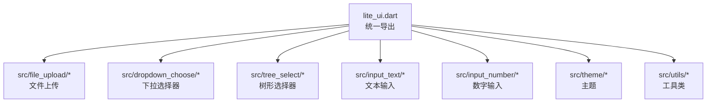
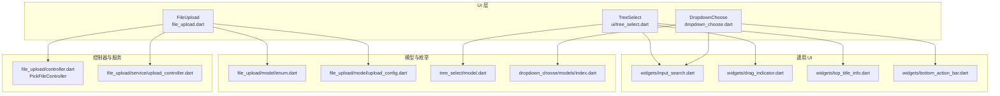
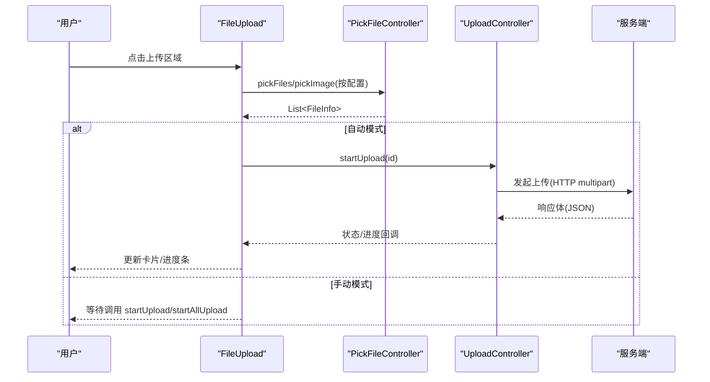
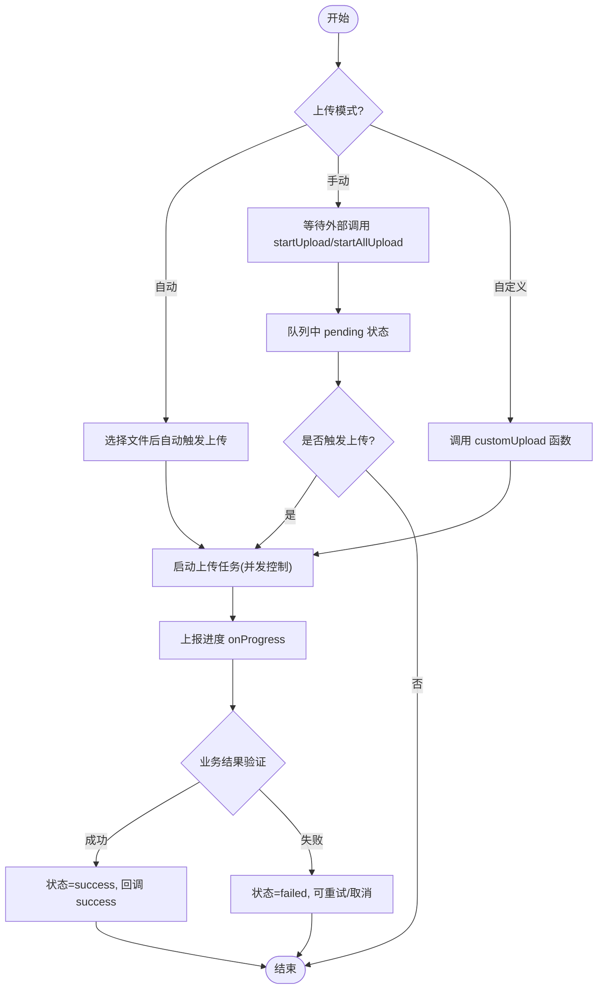
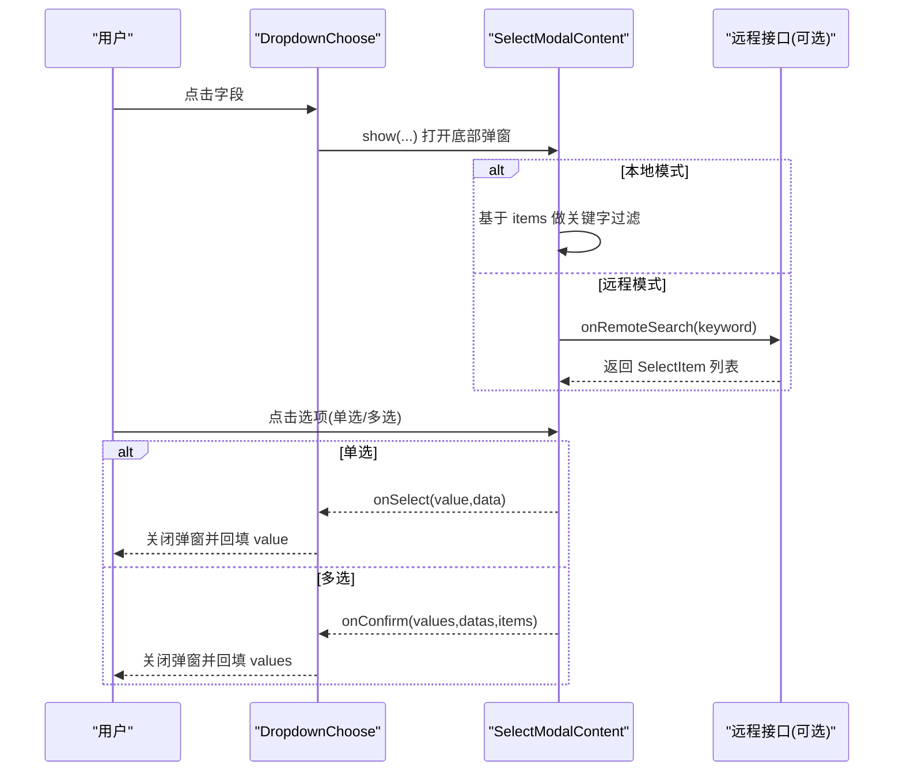
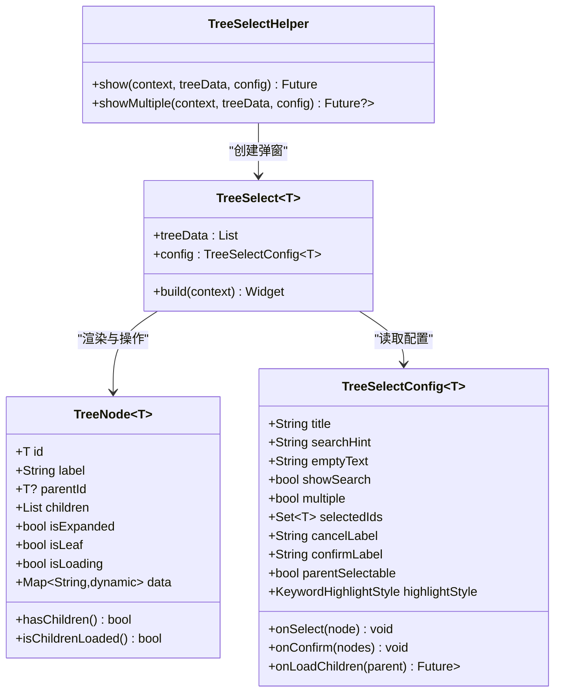
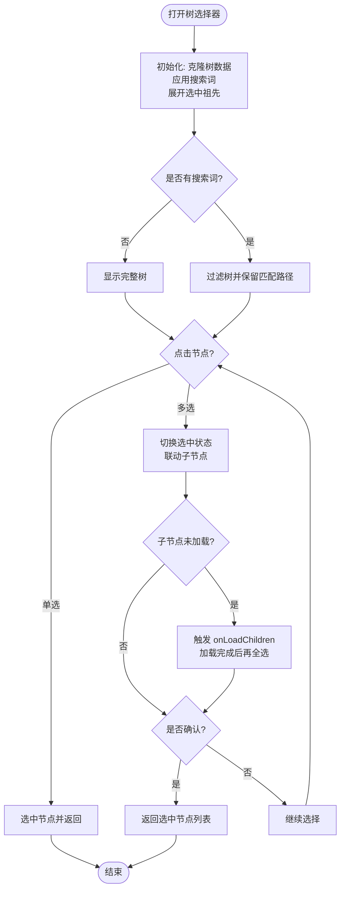
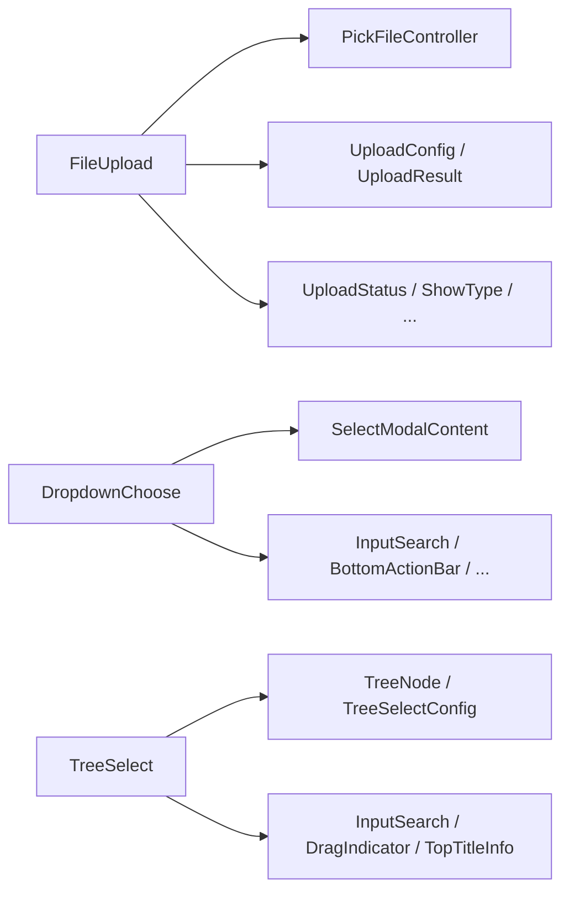

# 高级组件

<cite>
**本文引用的文件**   
- [lite_ui.dart](file://lib/lite_ui.dart)
- [file_upload.dart](file://lib/src/file_upload/file_upload.dart)
- [enum.dart](file://lib/src/file_upload/model/enum.dart)
- [upload_config.dart](file://lib/src/file_upload/model/upload_config.dart)
- [controller.dart](file://lib/src/file_upload/controller.dart)
- [dropdown_choose.dart](file://lib/src/dropdown_choose/dropdown_choose.dart)
- [index.dart](file://lib/src/dropdown_choose/models/index.dart)
- [select_modal_content.dart](file://lib/src/dropdown_choose/ui/select_modal_content.dart)
- [tree_select_helper.dart](file://lib/src/tree_select/tree_select_helper.dart)
- [model.dart](file://lib/src/tree_select/model.dart)
- [tree_select.dart](file://lib/src/tree_select/ui/tree_select.dart)
</cite>

## 目录
1. [简介](#简介)
2. [项目结构](#项目结构)
3. [核心组件](#核心组件)
4. [架构总览](#架构总览)
5. [详细组件分析](#详细组件分析)
6. [依赖关系分析](#依赖关系分析)
7. [性能考虑](#性能考虑)
8. [故障排查指南](#故障排查指南)
9. [结论](#结论)
10. [附录：API 参考与配置项](#附录api-参考与配置项)

## 简介
本文件面向 Lite UI 的高级组件，聚焦以下三个复杂交互组件的技术实现与使用指南：
- FileUpload（文件上传）：支持自动、手动、自定义三种上传模式；提供图片预览、进度管理、多列卡片/列表展示、头像模式等。
- DropdownChoose（下拉选择器）：支持本地过滤与远程搜索、多选联动、新增按钮扩展、已选值回显与标签解析。
- TreeSelect（树形选择器）：支持懒加载、关键字高亮、父子节点联动、单选/多选、底部弹窗交互。

文档从系统架构、数据流、处理逻辑到最佳实践进行分层说明，并附带可视化图示与 API 参考，帮助开发者快速掌握并落地复杂业务场景。

## 项目结构
Lite UI 通过统一入口导出各模块，便于按需引入。核心模块包括空状态、树形选择、动作面板、下拉选择、对话框、文件上传、输入控件、主题与工具类等。

图表来源 
- [lite_ui.dart:1-19](file://lib/lite_ui.dart#L1-L19)

章节来源
- [lite_ui.dart:1-19](file://lib/lite_ui.dart#L1-L19)

## 核心组件
- FileUpload：封装文件选择、预览、上传控制与状态管理，支持多种展示模式与上传策略。
- DropdownChoose：表单级下拉选择器，内置校验、显示模式、远程搜索与新增能力。
- TreeSelect：树形数据的选择器，支持懒加载、搜索高亮、父子联动与多选确认。

章节来源
- [file_upload.dart:15-165](file://lib/src/file_upload/file_upload.dart#L15-L165)
- [dropdown_choose.dart:11-242](file://lib/src/dropdown_choose/dropdown_choose.dart#L11-L242)
- [tree_select_helper.dart:11-118](file://lib/src/tree_select/tree_select_helper.dart#L11-L118)

## 架构总览
下图展示了三大组件在 Flutter 应用中的交互关系与关键依赖：

图表来源 
- [file_upload.dart:1-14](file://lib/src/file_upload/file_upload.dart#L1-L14)
- [enum.dart:1-105](file://lib/src/file_upload/model/enum.dart#L1-L105)
- [upload_config.dart:1-139](file://lib/src/file_upload/model/upload_config.dart#L1-L139)
- [controller.dart:1-68](file://lib/src/file_upload/controller.dart#L1-L68)
- [dropdown_choose.dart:1-10](file://lib/src/dropdown_choose/dropdown_choose.dart#L1-L10)
- [index.dart:1-9](file://lib/src/dropdown_choose/models/index.dart#L1-L9)
- [select_modal_content.dart:1-12](file://lib/src/dropdown_choose/ui/select_modal_content.dart#L1-L12)
- [tree_select.dart:1-10](file://lib/src/tree_select/ui/tree_select.dart#L1-L10)
- [model.dart:1-10](file://lib/src/tree_select/model.dart#L1-L10)

## 详细组件分析

### FileUpload（文件上传）
- 功能要点
  - 选择方式：文件、相册、拍照、组合选择，支持限制扩展名与数量。
  - 展示模式：卡片网格、文本列表、自定义构建器。
  - 上传模式：自动、手动、自定义；并发控制、失败重试、进度回调。
  - 预览与操作：图片预览、替换、删除、重试、成功标记。
  - 头像模式：内部强制单图、相机或相册选择。
- 数据结构与状态
  - 文件信息：包含 id、name、path、size、source、status、progress、data 等。
  - 上传状态：pending、uploading、success、failed。
  - 变更动作：defaultLoad、add、remove、uploading、progress、success、failed。
- 关键流程
  - 选择文件后根据模式触发自动上传或等待手动触发。
  - 上传过程中通过控制器更新状态与进度，并回调 onProgress 与 onFileChanged。
  - 外部可通过 GlobalKey<FileUploadState> 调用 startUpload/startAllUpload/cancelUpload/updateFileStatus。

图表来源 
- [file_upload.dart:379-447](file://lib/src/file_upload/file_upload.dart#L379-L447)
- [controller.dart:17-66](file://lib/src/file_upload/controller.dart#L17-L66)
- [upload_config.dart:38-98](file://lib/src/file_upload/model/upload_config.dart#L38-L98)

图表来源 
- [file_upload.dart:282-337](file://lib/src/file_upload/file_upload.dart#L282-L337)
- [upload_config.dart:19-29](file://lib/src/file_upload/model/upload_config.dart#L19-L29)

章节来源
- [file_upload.dart:15-165](file://lib/src/file_upload/file_upload.dart#L15-L165)
- [file_upload.dart:266-376](file://lib/src/file_upload/file_upload.dart#L266-L376)
- [file_upload.dart:379-447](file://lib/src/file_upload/file_upload.dart#L379-L447)
- [file_upload.dart:452-594](file://lib/src/file_upload/file_upload.dart#L452-L594)
- [enum.dart:1-105](file://lib/src/file_upload/model/enum.dart#L1-L105)
- [upload_config.dart:1-139](file://lib/src/file_upload/model/upload_config.dart#L1-L139)
- [controller.dart:1-68](file://lib/src/file_upload/controller.dart#L1-L68)

### DropdownChoose（下拉选择器）
- 功能要点
  - 两种模式：本地过滤（filterable）与远程搜索（remote）。
  - 单选/多选：单选点击即关闭；多选切换勾选并通过 onConfirm 确认。
  - 显示模式：文本、标签滚动、紧凑标签（+M）。
  - 新增扩展：搜索无结果时显示“新增”按钮，异步完成后刷新列表。
  - 已选值回显：支持 selectedValues 与 selectedItems，解析 label 并回显。
- 关键流程
  - 打开弹窗：根据模式加载数据（本地 items 或 onRemoteSearch）。
  - 搜索过滤：本地模式直接过滤；远程模式调用回调并合并结果。
  - 选中与确认：单选立即返回；多选收集 values/datas/items，确认后返回。

图表来源 
- [dropdown_choose.dart:133-202](file://lib/src/dropdown_choose/dropdown_choose.dart#L133-L202)
- [select_modal_content.dart:184-227](file://lib/src/dropdown_choose/ui/select_modal_content.dart#L184-L227)
- [select_modal_content.dart:296-330](file://lib/src/dropdown_choose/ui/select_modal_content.dart#L296-L330)

章节来源
- [dropdown_choose.dart:11-242](file://lib/src/dropdown_choose/dropdown_choose.dart#L11-L242)
- [dropdown_choose.dart:244-392](file://lib/src/dropdown_choose/dropdown_choose.dart#L244-L392)
- [index.dart:1-9](file://lib/src/dropdown_choose/models/index.dart#L1-L9)
- [select_modal_content.dart:1-127](file://lib/src/dropdown_choose/ui/select_modal_content.dart#L1-L127)
- [select_modal_content.dart:130-227](file://lib/src/dropdown_choose/ui/select_modal_content.dart#L130-L227)
- [select_modal_content.dart:296-330](file://lib/src/dropdown_choose/ui/select_modal_content.dart#L296-L330)

### TreeSelect（树形选择器）
- 功能要点
  - 数据结构：TreeNode<T> 包含 id、label、parentId、children、isLeaf、isLoading、data 等。
  - 懒加载：展开父节点时调用 onLoadChildren 获取子节点，并同步回原始数据。
  - 搜索高亮：关键字匹配 label，支持高亮样式配置。
  - 父子联动：默认点击父节点仅展开/折叠；所有子节点选中时父节点自动联动选中。
  - 多选确认：底部确认按钮返回选中节点列表。
- 关键流程
  - 初始化：克隆树数据，应用搜索词，展开选中节点的祖先路径。
  - 搜索过滤：清空关键词恢复全量；否则过滤并保留匹配路径。
  - 选择逻辑：单选点击即返回；多选联动子节点，必要时懒加载后再全选。

图表来源 
- [model.dart:11-44](file://lib/src/tree_select/model.dart#L11-L44)
- [model.dart:59-122](file://lib/src/tree_select/model.dart#L59-L122)
- [tree_select_helper.dart:19-64](file://lib/src/tree_select/tree_select_helper.dart#L19-L64)
- [tree_select_helper.dart:72-117](file://lib/src/tree_select/tree_select_helper.dart#L72-L117)
- [tree_select.dart:17-28](file://lib/src/tree_select/ui/tree_select.dart#L17-L28)

图表来源 
- [tree_select.dart:42-77](file://lib/src/tree_select/ui/tree_select.dart#L42-L77)
- [tree_select.dart:88-95](file://lib/src/tree_select/ui/tree_select.dart#L88-L95)
- [tree_select.dart:99-123](file://lib/src/tree_select/ui/tree_select.dart#L99-L123)
- [tree_select.dart:146-170](file://lib/src/tree_select/ui/tree_select.dart#L146-L170)

章节来源
- [tree_select_helper.dart:11-118](file://lib/src/tree_select/tree_select_helper.dart#L11-L118)
- [model.dart:1-123](file://lib/src/tree_select/model.dart#L1-L123)
- [tree_select.dart:17-238](file://lib/src/tree_select/ui/tree_select.dart#L17-L238)

## 依赖关系分析
- FileUpload 依赖：
  - PickFileController：封装 file_picker 与 image_picker，统一返回 FileInfo。
  - UploadController：管理并发上传、重试、进度与状态回调。
  - 枚举与配置：UploadStatus、ShowType、FileSource、FileAction、PickFile、ActionFileSheet、UseType、UploadMode、UploadConfig、UploadResult。
- DropdownChoose 依赖：
  - SelectModalContent：统一内容组件，处理本地/远程数据、搜索、选择与确认。
  - 通用 UI：InputSearch、DragIndicator、TopTitleInfo、BottomActionBar。
- TreeSelect 依赖：
  - TreeNode/TreeselectConfig：数据模型与配置。
  - 通用 UI：InputSearch、DragIndicator、TopTitleInfo。

图表来源 
- [file_upload.dart:1-14](file://lib/src/file_upload/file_upload.dart#L1-L14)
- [controller.dart:1-68](file://lib/src/file_upload/controller.dart#L1-L68)
- [upload_config.dart:1-139](file://lib/src/file_upload/model/upload_config.dart#L1-L139)
- [enum.dart:1-105](file://lib/src/file_upload/model/enum.dart#L1-L105)
- [dropdown_choose.dart:1-10](file://lib/src/dropdown_choose/dropdown_choose.dart#L1-L10)
- [select_modal_content.dart:1-12](file://lib/src/dropdown_choose/ui/select_modal_content.dart#L1-L12)
- [tree_select.dart:1-10](file://lib/src/tree_select/ui/tree_select.dart#L1-L10)
- [model.dart:1-10](file://lib/src/tree_select/model.dart#L1-L10)

章节来源
- [file_upload.dart:1-14](file://lib/src/file_upload/file_upload.dart#L1-L14)
- [controller.dart:1-68](file://lib/src/file_upload/controller.dart#L1-L68)
- [upload_config.dart:1-139](file://lib/src/file_upload/model/upload_config.dart#L1-L139)
- [enum.dart:1-105](file://lib/src/file_upload/model/enum.dart#L1-L105)
- [dropdown_choose.dart:1-10](file://lib/src/dropdown_choose/dropdown_choose.dart#L1-L10)
- [select_modal_content.dart:1-12](file://lib/src/dropdown_choose/ui/select_modal_content.dart#L1-L12)
- [tree_select.dart:1-10](file://lib/src/tree_select/ui/tree_select.dart#L1-L10)
- [model.dart:1-10](file://lib/src/tree_select/model.dart#L1-L10)

## 性能考虑
- 文件上传
  - 并发控制：通过 maxConcurrent 限制同时上传数，避免阻塞网络与内存。
  - 进度更新：仅在状态变化时 setState，减少重建开销。
  - 大文件优化：建议分片上传与断点续传（需自定义上传函数）。
- 下拉选择器
  - 本地过滤：对长列表建议使用分页或虚拟列表。
  - 远程搜索：防抖与缓存搜索结果，避免重复请求。
  - 已选值解析：延迟解析 label，减少初始渲染压力。
- 树形选择器
  - 懒加载：仅在展开时加载子节点，降低首屏数据量。
  - 搜索过滤：克隆树并过滤，避免修改原始数据导致频繁重建。
  - 高亮渲染：限制高亮范围，避免全树重绘。

## 故障排查指南
- FileUpload
  - 无法选择文件：检查 allowedExtensions 与设备权限；Android 多选需 FileType.custom。
  - 上传失败：查看 validateResult 与 HTTP 状态码；启用 retryCount 重试。
  - 进度不更新：确认 onProgress 回调与状态更新逻辑。
- DropdownChoose
  - 远程搜索无结果：检查 onRemoteSearch 返回值结构与网络错误处理。
  - 已选值显示为 ID：确保 selectedItems 或 onLabelsResolved 正确填充 label。
  - 多选上限无效：确认 maxCount 与 multiple 配置。
- TreeSelect
  - 懒加载不生效：确认 onLoadChildren 返回子节点并同步到原始数据。
  - 搜索无匹配：检查关键字匹配规则与高亮样式配置。
  - 父子联动异常：确认 parentSelectable 与联动逻辑。

章节来源
- [file_upload.dart:282-337](file://lib/src/file_upload/file_upload.dart#L282-L337)
- [select_modal_content.dart:184-227](file://lib/src/dropdown_choose/ui/select_modal_content.dart#L184-L227)
- [tree_select.dart:146-170](file://lib/src/tree_select/ui/tree_select.dart#L146-L170)

## 结论
Lite UI 的三大高级组件提供了丰富的交互能力与灵活的配置选项，覆盖文件上传、下拉选择与树形选择的核心场景。通过合理的架构设计与性能优化，开发者可以快速构建稳定、易用且可扩展的表单与数据选择界面。

## 附录：API 参考与配置项

### FileUpload
- 主要参数
  - pickFile：选择方式（file/gallery/camera/all/imageOrCamera）
  - multiple：是否多选
  - limit：文件数量限制（-1 表示不限制）
  - allowedExtensions：允许的文件扩展名
  - showType：展示类型（card/textInfo/custom）
  - uploadConfig：上传配置（mode/url/method/headers/fields/fileField/maxConcurrent/retryCount/customUpload/validateResult）
  - useType：使用方式（normal/avatar）
  - fileList：初始文件列表（编辑回显）
  - onFileChanged：文件变更回调（action: defaultLoad/add/remove/uploading/progress/success/failed）
  - onProgress：上传进度回调（id,path,progress）
  - previewSize/columns/spacing/alignment：布局与尺寸
  - actionDecoration/actionTitleStyle/uploadButtonBuilder：上传区域样式与自定义按钮
- 公开方法
  - startUpload(id)：上传指定文件
  - startAllUpload()：上传所有待上传文件
  - cancelUpload(id)：取消上传
  - updateFileStatus(id,status)：更新文件状态

章节来源
- [file_upload.dart:15-165](file://lib/src/file_upload/file_upload.dart#L15-L165)
- [file_upload.dart:266-337](file://lib/src/file_upload/file_upload.dart#L266-L337)
- [upload_config.dart:38-98](file://lib/src/file_upload/model/upload_config.dart#L38-L98)
- [enum.dart:1-105](file://lib/src/file_upload/model/enum.dart#L1-L105)

### DropdownChoose
- 主要参数
  - formLabel：表单标签
  - value/selectedValues：当前选中值（单选/多选）
  - items：选项列表（本地模式必填）
  - selectedItems：已选中项完整数据（用于回显 label）
  - type：选择器模式（filterable/remote）
  - onRemoteSearch：远程搜索回调（remote 模式必填）
  - multiple：是否多选
  - displayMode：值显示模式（text/tags/compact）
  - maxShowTags：紧凑模式下最多显示标签数
  - valueBuilder：自定义值显示构建器
  - showAdd/addLabel/onAdd：新增按钮与回调
  - onLabelsResolved：已选值 label 解析回调
  - onSelect/onConfirm：选中与确认回调
  - maxCount：多选最大可选数量
  - validator/autovalidateMode/formLayout：表单校验与布局
- 静态方法
  - show(context,...)：弹出底部选择器弹窗

章节来源
- [dropdown_choose.dart:11-242](file://lib/src/dropdown_choose/dropdown_choose.dart#L11-L242)
- [dropdown_choose.dart:133-202](file://lib/src/dropdown_choose/dropdown_choose.dart#L133-L202)
- [select_modal_content.dart:1-127](file://lib/src/dropdown_choose/ui/select_modal_content.dart#L1-L127)
- [index.dart:1-9](file://lib/src/dropdown_choose/models/index.dart#L1-L9)

### TreeSelect
- 主要参数
  - treeData：树形数据源（List<TreeNode<T>>）
  - config：配置（title/searchHint/emptyText/showSearch/multiple/selectedIds/onSelect/onConfirm/onLoadChildren/cancelLabel/confirmLabel/parentSelectable/highlightStyle）
- 便捷方法
  - TreeSelectHelper.show(context,...)：单选弹窗
  - TreeSelectHelper.showMultiple(context,...)：多选弹窗

章节来源
- [tree_select_helper.dart:11-118](file://lib/src/tree_select/tree_select_helper.dart#L11-L118)
- [model.dart:1-123](file://lib/src/tree_select/model.dart#L1-L123)
- [tree_select.dart:17-238](file://lib/src/tree_select/ui/tree_select.dart#L17-L238)